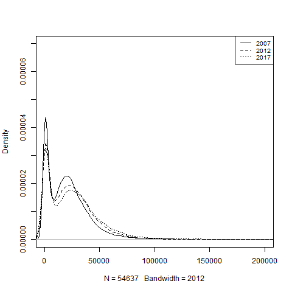
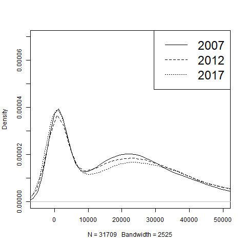
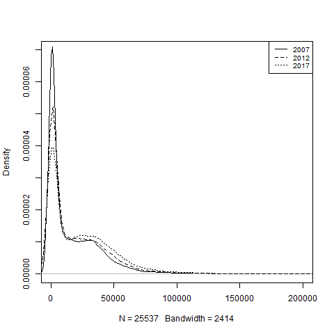
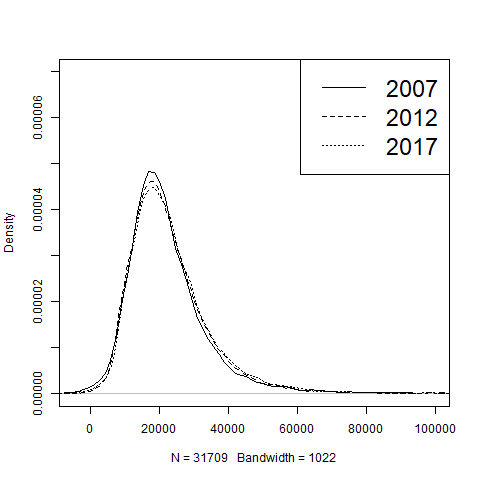
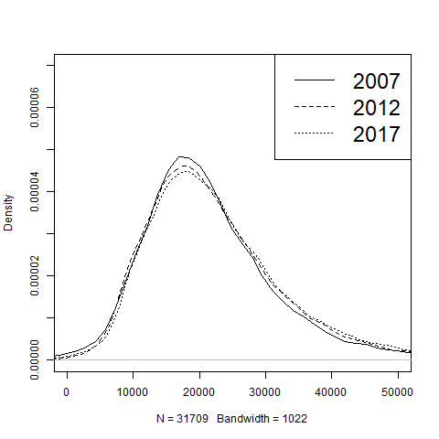
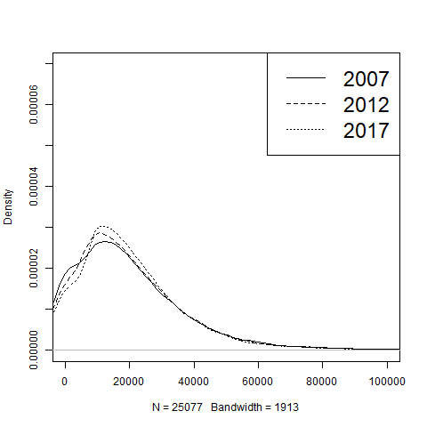
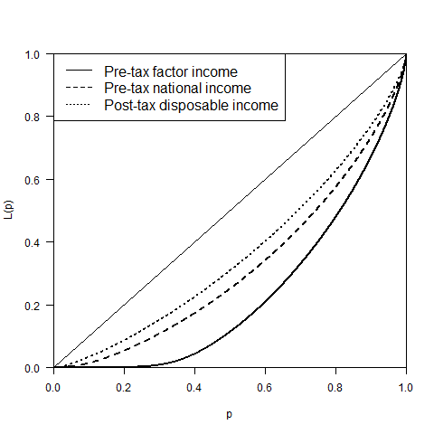
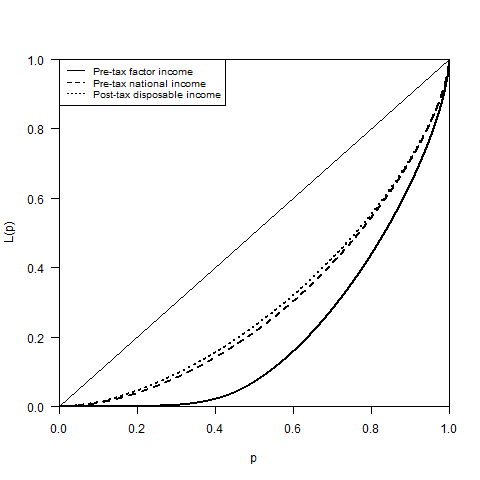

```{r setup, include=FALSE}
knitr::opts_chunk$set(echo = TRUE)
```

\newpage

# Einleitung

Einleitung:

Die wachsende Ungleichheit der Gesellschaft und dass „schrumpfen“ der Mittelschicht sind Nachrichtentechnische Dauerbrenner, in den Medien wird dies häufig nach einschlägigen Ereignissen thematisiert. Während in den letzten Monaten des Jahres 2018 in Frankreich die „gelb Westen“ das Thema Ungleichheit in die weltweiten Nachrichten brachten bewirkte die Aussage des Kandidaten für den CDU Parteivorsitz Friedrich Merz dass er der Mittelschicht angehöre die Diskussion in den Kontext der Bundesrepublik. 
(https://www.zeit.de/politik/deutschland/2018-11/friedrich-merz-cdu-vorsitz-einkommen Stand 26.12.2016: 21:45 Uhr) 
(https://www.sueddeutsche.de/news/politik/demonstrationen-gelbwesten-protest-keine-krawalle-aber-neue-forderungen-dpa.urn-newsml-dpa-com-20090101-181216-99-241315 Stand 04.01.2019: 21:34 Uhr)


In der folgenden Arbeit werden anhand der EU-Silc Daten von 2005 bis 2017 die Ungleichheit und Verteilung im allgemeinen und die Entwicklung der deutschen Mittelschicht betrachtet. Bezugnehmend auf die zwei Schwerpunkte der hier vorliegenden Arbeit nämlich die Ungleichheit im allgemeinen und die Entwicklung der Mittelschicht im speziellen, ist es unerlässlich zuerst die bereits vorhandene Literatur zu sichten und den aktuellen Stand der Forschung zu ermitteln. Im weiteren Verlauf werden wir die Berechnungen der Daten erläutern und sie im Kontext mit der Ungleichheit setzten. Für die ausführliche Analyse der Ungleichheit werden wir die Entwicklung des Ginikoeffizienten und des P80/P20 Ratios betrachten.

Der zweite Teil der Arbeit, wird wie bereits erwähnt sich auf die Entwicklung der deutschen Mittelschicht konzentrieren. Da die bereits vorhandene Literatur über die deutsche Mittelschicht häufig qualitativer Natur ist wird unsererseits der Schwerpunkt auf die quantitative Analyse gesetzt und ob diese zu unterschiedlichen Erkenntnissen kommt. Durch die Komplexität des Themas haben wir uns dazu entschieden nicht nur die gesamte Bevölkerung auszuwerten, sondern auch verschiedene Untergruppen und ihre Entwicklung. Neben der gesamten Bevölkerung werden Single Haushalte, Haushalte mit zwei Kindern und Personen über 65 Jahre gesondert ausgewertet. Diese Auswertung zielt darauf ab herauszufinden ob eine eventuelle Veränderung der Mittelschicht für die gesamte Bevölkerung ähnlich von statten geht oder ob eventuell gefunden Unterschiede nur auf Veränderungen in einer Untergruppe zurückzuführen sind. 


Wir konzentrieren uns nicht auf Wage Inequality sondern Post-tax disposable income 

# Entwicklung der Ungleichheit in Deutschland, allgemeine Ungleichheitsindikatoren 

## Literaturdiskussion 

Zahlreiche Veröffentlichungen beobachten steigende Einkommensungleichheit in Deutschland seit Beginn des 21. Jahrhunderst bis 2005 (@feld2016jenseits, @biewen2017did, @horn2018entstand, @grabka2017realeinkommen und weitere). Über das Bild nach 2005 herrscht Uneinigkeit.

@biewen2017did bestätigen die steigende Ungleichheit bis 2005 und sehen keine Fortsetzung dieses Trends nach 2005. In ihrem Artikel von 2012 nannten Biewen und Juhasz die wachsende Ungleichverteilung der Arbeitseinkommen als Hauptursache für die wachsende Einkommensungleichheit zwischen 1999/2000 und 2005/2006. Jedoch sollen auch Änderungen in den Arbeitsergebnissen und dem Steuersystem dazu beigetragen haben [@biewen2012understanding].

Auch Grabka und Goebel argumentieren, dass die Einkommensungleichheit nach 2005 zunächst nicht weiter zunahm, beobachten jedoch einen erneuten Anstieg der Ungleichheit ab 2012. Insgesamt sei das verfügbaren Einkommen der privaten Haushalte in Deutschland von 1991 bis 2014 real, also unter Berücksichtigung der Preisentwicklung, um zwölf Prozent gestiegen. Jedoch verlief die Entwicklung für verschiedene Einkommensgruppen unterschiedlich. Die mittleren Einkommen sind demnach um mehr als acht Prozent gestiegen, die höchsten Einkommen legten um bis zu 26 Prozent zu. Die unteren Einkommen gingen hingegen real zurück. Auch das Risiko, arm zu sein, sei zuletzt wieder gestiegen [@grabka2017realeinkommen].

@horn2017tun beobachtet hingegen einen gedämpften, jedoch weiteren Anstieg nach 2005. Er nennt die Umverteilung zugunsten Kapitaleinkommen, höhere Ungleichheit innerhalb der Lohneinkommen, sowie eine regressive Steuer und Abgabenpolitik als Hauptursachen. Abgeschwächt wurde die Zunahme in der Einkommensungleichheit, laut @horn2014wirtschaftskrise, durch den starken Einbruch der Kapitaleinkommen wärend der Wirtschaftskrise. Die Zunehmende Bedeutung von Kapitaleinkommen hatte vor der Krise die Einkommensungleichheit vorangetrieben.  

Laut @jessen2016has hätten, gemessen am Gini-Koeffizienten, Steuer- und Transferreformen einen Ungleichheits-reduzierenden Einfluss gehabt. Dieser Effekt sei jedoch durch Änderungen im Arbeitsangebot ausgeglichen worden. Sie sieht daher Änderungen in der Gesellschaft als Ursache der steigenden Einkommensungleichheit zwischen 2002 und 2011.

Dieser Artikel trägt zur der Diskussion über die Entwicklung der Ungleichheit in Deutschland speziell ab 2005 bei. Vorhergegangenen Studien decken einen Zeitraum bis 2016 ab. Wir erweitern diese Spanne mit Daten für 2017. Betrachtet werden drei verschiedene Einkommenskonzepte. Die Berechnungen und Ergebnisse werden in den folgenden Abschnitten erläutert.


## Daten und Berechnungen
Als Datengrundlage verwenden wir die EU-Statistik über Einkommen und Lebensbedingungen (EU Statistics on Income and Living Conditions – EU-SILC) von 2005 bis 2017. Zur Berechnung der Ungleichheitsentwicklung in Deutschland wurden drei verschiedene Einkommenskomponenten herangezogen. Das vorsteuerliche Faktoreinkommen (Pre-tax factor income) umfasst Arbeits- und Vermögenseinkommen. Die entsprechenden Ungleichheitsindikatoren geben wieder, wie hoch die Ungleichheit in Deutschland wäre, gäbe es kein öffentliches Transfersystem. Das Pre-tax national income erfasst zusätzlich Pensionen und Arbeitslosengeld. Das nachsteuerliche, verfügbare Einkommen (Post-tax disposable income) zeigt, wie der Staat die Verteilung der verfügbaren Einkommen durch Steuern und Sozialleistungen beeinflusst. Diese Einkommenskonzepte wurden auf jeweils zwei unterschiedliche Arten aufgeteilt: 1. Alle Einkommensgrößen werden äquivalisiert durch alle Haushaltsmitglieder geteilt (equal sharing of resources within household) und 2. die personenbezogenen Einkommensgrößen bleiben den entsprechenden Personen zugeordnet, die Haushalsgrößen werden durch Haushaltsmitglieder geteilt, die älter als 19 Jahre sind (partial sharing of resources). Einkommenskomponenten unter null wurden von der Berechnung der Indikatoren ausgeschlossen. Zu beachten ist, dass es über die Jahre zu Änderungen in der Definition der EU-SILC-Daten kam. Damit ist der Vergleich zwischen den Jahren nicht uneingeschränkt möglich, dennoch lassen sich daraus interessante Entwicklungen ablesen.   

## Graphische Betrachtung

Die Verteilung der Pre-tax factor incomes zeigt, dass die meisten Einkommen zwischen 0 und 40 000 pro Jahr liegen (Figure 1, Figure 2, Figure 3). Bei den ersten beiden Grafiken wurden die Einkommen durch alle Haushaltsmitglieder geteilt.  Die zweite Grafik (Figure 2) betrachtet den Bereich der besonders häufigen Einkommen genauer. Daraus lässt sich erkennen: Am häufigsten sind Einkommen unter 6 000. Für 2007 ist der Bereich besonders hoch. Ein zweiter "Hügel" erstreckt sich zwischen 10 000 und 30 000. In den Jahren 2012 und 2017 werden geringe Einkommen weniger häufig, die Kurve wird flacher. Jedoch steigen besonders hohe Einkommen, sodass sich das rechte Ende der Einkommensverteilung nach rechts zieht (Figure 1). Das deutet darauf hin, dass der Einkommensanteil der oberen zehn Prozent zugenommen hat. Bleiben die personenbezogenen Einkommen den jeweiligen Personen zugeordnet (Figure 3), erhöht sich der Anteil der Menschen mit einem Einkommen unter 6000, da es in dieser Aufteilung einen geringeren Ausgleich innerhalb eines Haushaltes zum Beispiel bei Ehepartner/innen gibt.

Beim Post-tax disposable income werden die staatlichen Transfersysteme berücksichtigt (Figure 4, Figure 5, Figure 6). Die ersten beiden Grafiken beziehen sich auf eine Aufteilung der Einkommen auf alle Haushaltsmitglieder, Figure 6 enthält die Aufteilung auf erwachsene Haushaltsmitglieder. Durch die Transferleistungen verschiebt sich der "Hügel" nach rechts. Die häufigsten Einkommen liegen nun zwischen 10 000 und 30 000. Zwischen 2007 und 2017 flacht die Kurve ab und verschiebt sich nach rechts. Damit werden niedrigere Einkommen seltener. Jedoch steigen auch bei den Post-tax disposable incomes extrem hohe Werte stark an. In Figure 6 gibt es 2007 eine größere Konzentration der Einkommen am linken Rand, diese schwächt sich über 2012 bis 2017 ab.  

Insgesamt haben niedrigere Einkommen seit 2007 abgenommen, was einen ungleichheits-verringernden Effekt hat. Besonders extreme Einkommen und damit der Einkommensanteil der oberen zehn Prozent haben sich erhöht. Die Auswirkungen auf andere Ungleichheitsindikatoren ist allein durch die Betrachtung der Verteilung nicht eindeutig und wird im folgenden Abschnitt anhand der Ungleichheitsindikatoren aufgeschlüsselt. 

In Figure 7 und 8 sind die Lorenzkurven der verschiedenen Einkommenskonzepte für 2017 abgebildet. Damit lässt sich der ausgleichende Effekt des Transfersystems beobachten. Figure 7 enthält die Einkommenskonzepte für eine gleichmäßige Einkommensaufteilung innerhalb der Haushalte, bei Figure 8 die personenabhängige Aufteilung für Erwachsene. Die diagonale Linie stellt die ideale Gleichverteilung dar. Wie erwartet sind beim Pre-tax factor income ohne Transferleistungen die Einkommen am wenigsten gleich Verteilt. Das Post-tax disposable income erreicht die "fairste" Einkommensverteilung. Besonders drastisch ist der Unterschied in Figure 8 bei der personenabhängigen Einkommensaufteilung. Die untere Einkommenshälfte erhält gerade einmalzehn Prozent des gesamten Einkommens. Sowohl in Figure 7, als auch in Figure 8 ist das untere Ende des Pre-tax factor incomes besonders flach und wird stetig steiler. Je höher die Einkommensgruppe, desto schneller steigt ihr Anteil am Gesamteinkommen. Die zeitliche Entwicklung der Ungleichheitsindikatoren ist wird im nächsten Abschnitt betrachtet. 

##Ergebnisse
Die folgenden Tabellen zeigen, wie sich die Ungleichheit in Deutschland zwischen 2005 und 2017 verändert hat. Der Mittelwert und der Median des Pre-tax factor incomes (Tabelle 1) ist insgesamt zwischen 2005 und 2017 angestiegen. Lediglich 2006 gab es einen Rückgang im Vergleich zum Vorjahr. Der Gini-Koeffizient stieg bis 2008 an, was auf einen Anstieg der Einkommensungleichheit hindeutet. Nach 2008 ging der Gini-Koeffizient wieder leicht zurück, liegt jedoch weiterhin über dem Wert von 2005. Die P80/P20-Ratio zeigt um wie viel höher das Einkommen der "einkommensstarken" Bevölkerung (80. Perzentil) im Vergleich zur "einkommensschwachen" Bevölkerung (20. Perzentil) ist. Die P80/P20-Ratio stieg von 2005 auf 2006 zunächst deutlich an und zeigt seither ein wechselhaftes Bild mit einem Peak im Jahr 2011. Der Einkommensanteil der reichsten zehn Prozent ist von 2005 auf 2006 leicht gesunken, stieg jedoch nach 2006 zunächst sprunghast an und ist 2017 mehr als doppelt so hoch als 2005. Auch bei der personenabhängigen Einkommensaufteilung (Tabelle 2) steigen Mittelwert und Median zwischen 2005 und 2017 insgesamt an. Die Einkommenseinbußen ab 2006 machen sich hier stärker bemerkbar. Bis 2007 sinken Mittelwert und Median. Erst 2012 können sich die Einkommen wieder auf ein Niveau von vor der Krise erholen. Bei dem Median sind die Einschnitte drastischer als beim Mittelwert. Da der Mittelwert sensibler auf extreme Werte reagiert, könnte hier ein Anstieg in den besonders hohen Einkommensgruppen insgesamt angefallene Verluste abgefedert haben, was auch den sprunghaften Anstieg der Ungleichheitsindikatoren in diesem Zeitraum erklären würde. Der Gini-Koeffizient und der Einkommensanteil der oberen zehn Prozent sind bei den erwachsenen Haushaltsmitgliedern insgesamt etwas höher, als unter Einbezug der 20-Jährigen. Die P80/P20-Ratio ist in Tabelle 2 um ein Vielfaches erhöht. Das spiegelt die Beobachtungen der Lorenzkurve (Figure 8) aus dem vorherigen Kapitel wieder, die zeigten, dass bei dieser Art der Einkommensaufteilung die unteren Einkommensgruppen besonders wenig Anteil am Gesamteinkommen haben.   

Mittelwert und Median sind beim Pre-tax national income (Tabelle 3 und 4) höher, da hier Pensionen und Arbeitslosengelder berücksichtigt werden. Die Ungleichheit wird dadurch etwas verringert, ist jedoch insgesamt noch recht hoch. Bis 2007 sinken Mittelwert und Median der Einkommen, danach steigen sie stetig an. Nach 2006 erhöht sich der Gini-Koeffizient sprunghaft und bleibt bis 2013 auf einem relativ hohen Niveau. Bei der personenabhängigen Einkommensaufteilung ist der Anstieg des Gini-Koeffizienten deutlich stärker. Analog dazu verläuft die P80/P20-Ratio. Der Einkommensanteil der reichsten 10 Prozent der Bevölkerung geht wie beim Pre-tax factor income von 2005 auf 2006 zurück, steigt jedoch danach stark an. Insgesamt erhöht sich das Einkommen der reichsten zehn Prozent für eine gleichmäßige Einkommensaufteilung um etwa 20 Prozentpunkte zwischen 2005 und 2017 für beide Einkommensaufteilungskonzepte.  

Für das Post-tax disposable income (Tabelle 5 und 6) sind Mittelwert und Median etwas niedriger als bei den vorsteuerlichen Einkommenskonzepten. Mit den Steuern und Transferzahlungen wird die Ungleichheit in den Einkommen verringert, wie Gini-Koeffizient und P80/P20-Ratio zeigen. Medianeinkommen und Mittelwert sind bis auf 2006 für das Post-tax disposable income bei gleichmäßiger Aufteilung innerhalb der Haushalte gestiegen (bei personenabhängiger Aufteilung sinkt das Einkommen 2006 und 2007). Der Gini-Koeffizient steigt bis 2008 an und kann dann zumindest für die personenabhängige Einkommensaufteilung nach 2013 wieder deutlich gesenkt werden. Für die gleichmäßige Einkommensaufteilung gibt es nach 2007 kaum Änderungen im Gini-Koeffizienten gemessen am post-tax disposable income. Den gleichen Trend in der Ungleichheitsentwicklung gibt die P80/P20-Ratio wieder. Wären Gini-Koeffizient und PP80/P20-Ratio insgesamt nur einen leichten Anstieg der Ungleichheit wiederspiegeln, erhöht sich der Einkommensanteil der reichsten zehn Prozent drastischer. Besonders groß war der Anstieg von 2006 auf 2007, danach bewegt sich der Einkommensanteil zyklisch auf einem relativ hohen Niveau. 

Zusammenfassend lassen sich folgende Trends ausmachen: Median und Mittelwert der verschiedenen Einkommenskonzepte sind zwischen 2005 und 2017 gestiegen. Besonders hat sich der Einkommensanteil der reichsten zehn Prozent der Bevölkerung erhöht. Gini-Koeffizient und P80/p20-Ratio steigen besonders von dem Jahr 2006 und 2007. Eine Stagnation der Einkommensungleichheit nach 2005, wie von @biewen2017did beschrieben, kann hier daher nicht bestätigt werden. Ein leichter Rückgang der Einkommensungleichheit ab 2007 kann für das Post-tax disposable income, gemessen am Gini-Koeffizienten und der P80/P20-Ratio beobachtet werden. Der steigende Einkommensanteil der reichsten zehn Prozent spricht jedoch für eine wachsende Konzentration an der Spitze der Einkommensverteilung. Um die Tendenzen in den mittleren Einkommenskategorien besser verstehen zu können. Wird in den nächsten Abschnitten die Mittelschicht mit einer Einteilung in oberer, strikten und unteren Mittelschicht genau betrachtet.  

# Die Entwicklung der Mittelschicht in Deutschland

Die Mittelschicht macht in Deutschland den Größten Teil der Bevölkerung aus. Seit Jahren wird in Deutschland jedoch das Schrumpfen der Mittelschicht diskutiert @grabka2008schrumpfende. Im weiteren Verlauf betrachten wir die Entwicklung der Mittelschicht zwischen 2005 und 2017. Die Komplexität der Definition der Mittelschicht wurde man sich spätestens bewusst durch die Aussage des Kandidaten für den CDU Parteivorsitz Friedrich Merz welcher sich mit einem jährlichen Einkommen von rund 1. Millionen Euro zur gehobenen Mittelschicht zählt. Merz beruft sich darauf, dass die Mittelschicht keine rein ökonomische Größe ist, sondern auch durch andere Werte wie Fleiß und Disziplin definiert wird. Das Hauptaugenmerk dieser Arbeit wird durch die Verwendung von EU-SILC geprägt welche die Einkommensdaten verschiedener Haushalte in Deutschland erfasst. Dies hat zur Folge, dass der Schwerpunkt der Betrachtung auf die ökonomische Komponente gelegt wird und weniger auf die soziologischen Eckpunkte der Mittelschicht. Definiert wird hier die Mittelschicht auf Grundlage des IW Köln, wonach die Mittelschicht im engeren Sinne über ein Einkommen von 80 bis 150 Prozent des Medianeinkommens verfügen. Im Folgendem wird zunächst ein kurzer Überblick über aktuelle Literatur zu dem Thema Mittelschicht gegeben und welche verschiedenen Ansätze der vorliegenden Thematik relevant sind.
[@niehues2017mittelschicht]

## Literaturdiskussion

Weitere Erkenntnisse zu der Deutschen Mittelschicht werden von @lengfeld2009angst in seiner Längsschnittanalyse im Jahr 2009 getroffen, welche ausführlich die vorherrschende Abstiegsangst der deutschen Mittelschicht behandelt und ob diese begründet ist. Diese Angst seinen gesellschaftlichen Status zu verlieren wird von @goebel2010polarisierung wieder aufgegriffen der zu dem Ergebnis kommt, dass in den Jahren 2000 bist 2009 die Unterschiede zwischen den gesellschaftlichen Schichten gewachsen ist, so gab es bei den oberen Schichten Zuwächse im Vermögen während bei den Geringverdienern absolute Verluste gab. Wenige Personen schafften den Aufstieg in eine obere Schicht aber viele sind in eine untere Schicht abgerutscht. Eine weitere Arbeit die zu den selbigen Resultaten kommt wurde von @bosch2015mittelschicht im Jahr 2015 veröffentlicht, hier wird ebenfalls das Schwinden der deutschen Mittelschicht und die Ausweitung der Geringverdiener mit Mini Jobs und prekären Beschäftigungen festgestellt. Die Statusangst der Mittelschicht wird auch bei @schoneck2011gefuhlte thematisiert mit der Conclusio, dass die Angst der Mittelschicht nicht auf eine Unterversorgung zurückzuführen ist, sondern dass das gesellschaftliche Ideal von Aufstieg und Wohlstand nicht mehr gültig ist. 


## Definitionsmöglichkeiten zur Mittelschicht 


###Sozio-ökonomische Definition 

Die gesellschaftlichen Schichten werden neben dem Einkommen noch durch andere qualitative Faktoren unterschieden über welche hier ein kurzer Überblick gegeben wird, im weiteren Verlauf dieser Arbeit wird dann ausführlich die Unterscheidung anhand des Einkommens diskutiert. So verwendet @niehues2013arm für die soziokulturelle Abgrenzung der Schichten abermals die, der IW Köln. Die Abgrenzung wird hier Anhand des beruflichen Werdegangs des Haupteinkommensbeziehers eines Haushaltes festgemacht und gilt für den gesamten Haushalt. So ist eine Vorrausetzung für die Mittelschicht, dass erlangen eines Berufsabschlusses, des weiteren gehören Facharbeiter/innen, Meister/innen und qualifizierte Angestellt der Mittelschicht an. Weitergedacht werden hier noch tiefergehende Unterscheidungen getroffen, so gehören Lehrer/innen noch der Mittelschicht an während Studiendirektor/innen und Lehrpersonal an Universitäten bereits der Oberschicht angehören. Es wird ersichtlich, dass die Unterscheidung der Mittelschichten nicht nur durch das Einkommen vorgenommen werden kann sondern auch durch soziokulturelle Faktoren, interessant wäre auch eine ausführliche Definition der Mittelschicht anhand [@bourdieu1987feinen] Habitus Theorie d.h. wie sich anhand der verschiedenen Kapitalarte die Mittelschicht der Gesellschaft definiert. Dies würde aber für eine qualitative Ausrichtung der Arbeit sprechen was hier nicht der betrachtete Aspekte der Arbeit ist. 

### Ökonomische Definition

Bei der Mittelschicht handelt es sich wie die Bezeichnung bereits vermuten lässt um die Mitte der Gesellschaft, die betroffenen Personen sind weder Armutsgefährdet noch außergewöhnlich vermögend. Für die ökonomische Unterteilung welcher Schicht ein Haushalt bzw. eine Person angehört wird im weiteren die Abgrenzung des Instituts der deutschen Wirtschaft in Köln verwendet. Die Unterteilung des IW Köln unterscheidet unsere Gesellschaft in fünf verschiedene Gruppen. Der Teil der Gesellschaft der von armutsgefährdet ist bezieht ein Einkommen welches unter 60% des Medianeinkommens liegt, während die Einkommensschwachen und untere Mitte zwischen 60%-80% des Medianeinkommens beziehen. Die wirkliche Mitte, welche von Niehues als Mitte im engeren Sinn bezeichnet wird, verfügt über ein Einkommen von 80%-150% vom Median. Die wohlhabenden Schichten spalten sich auf in die einkommensstarke/obere Mitte mit 150%-250% des Medians und die Einkommensreichen mit über 250% vom Medianeinkommen. Durch die Auflistung der Unterteilung des IW Köln wird ersichtlich, dass die Definition der Mittelschicht selbst über rein ökonomische Größen sehr breit gefasst ist, im engeren Sinn bezieht die Mittelschicht zwischen 80%-150% des Median während eine weitere Definition sämtliche Personen zwischen 60% und 250% vom Median zu der Mittelschicht zählen würde.
[@niehues2017mittelschicht]

Für die Berechnung der Mittelschicht verwenden wir das verfügbare Einkommen (Post-tax disposable income), damit wird das staatliche Transfersystem berücksichtigt. Personenbezogene Einkommen und Haushaltseinkommen werden äquivalisiert durch alle Haushaltsmitglieder geteilt.

## Ergebnisse

### Mittelschicht in der Gesamtbevölkerung  

Die Auswertungen der Mittelschicht, welche nach der oben erwähnten Definition der IW Köln abgestuft wurde, erfolgt durch die Betrachtung des „post-tax disposable income“. Das „post-tax dispoable income“ bezeichnet das verfügbare Einkommen der Haushalte nachdem sämtliche Steuern bezahlt wurden und enthält bereits staatliche Transferleistungen. Durch die Unterteilung der Mittelschicht in obere, untere und die enge Mitte wird ersichtlich wie sich die Veränderung der kompletten Mittelschicht zusammengesetzt hat. Anzumerken ist dass das Medianeinkommen der Gesamtenbevölkerung ebenfalls für die Berechnung der Untergruppen Single Haushalt, Haushalte mit zwei Kindern und Personen über 65 Jahren im weiteren Verlauf verwendet wird. Die Medianeinkommen in der Tablle 8-10 dienen zum Vergleich der Entwicklung des Medianeinkommens mit der Gesamtbevölkerung. In Tabelle 7 wird die Entwicklung der Mittelschicht in der gesamten Bevölkerung betrachtet. Es zeigt sich, dass, das Median Einkommen von 2005 bis 2006 um 1.033€ gesunken ist während wir im gesamten Zeithorizont einen Anstieg von 17.009€ im Jahr 2005 auf 22.616€ im Jahr 2017 beobachten können. Der Anteil der gesamten Mittelschicht an Bevölkerung nimmt in dem gleichen Zeitraum von 88,13% auf 83,95% ab. Die Zusammensetzung der Mittelschicht verschiebt sich über die Jahre stetig, es kommt zu einem Zuwachs bei der unteren Mitte welche 60%-80% des Medianeinkommens bezieht. Der Anteil der unteren Mitte erhöht sich im gesamten Zeithorizont von 15,22% im Jahr 2005 auf 18,63% im Jahr 2017, der Bevölkerung. Die größte Veränderung erfolgt in den Jahren 2005 bis 2006 in denen sich die untere Mitte um 2,61% verringert, dieser „Ausreißer“ in der Entwicklung ist auf die Veränderung des Median Income im selbigen Zeitraum zurückzuführen. Bis auf die „starke“ Veränderung der Mitte in den Jahren 2005 bis 2007 bleiben die Unterschiede zwischen den einzelnen Jahren meistens gering und bewegen sich deutlich unter 1%. 

Die obere Mittelschicht verändert sich gegenläufig zu der bereits diskutieren unteren Mitte, in den Jahren 2005 bis 2007 ist aber auch hier ein „Ausreißer“ ersichtlich. In den Jahren 2005 bis 2006 erfolgt ein Anstieg des Anteils der oberen Mitte, während sie in der gesamten Betrachtung abnimmt. Der Zuwachs zwischen 2005 bis 2006 um 3,18% auf 19,87% wird durch die Verringerung im Jahr 2007 auf 14.71% rückgängig gemacht. Zwischen den Jahren 2007 und 2017 bewegen sich die meisten Zuwächse/Verluste der oberen Mittelschicht unter 0,5% bis sie im Jahr 2017 schlussendlich 14,23% der betrachteten Bevölkerung ausmacht. 

Im Gegensatz zu der oberen und unteren Mitte ist die Veränderung der engen Mitte zwischen den Jahren 2005 bis 2007 weniger dramatisch ausgefallen, es erfolgt eine Abnahme von 56,22% im Jahr 2005 auf 55,09% in 2006 und eine weitere Verringerung des Anteils auf 52,81% im Jahr 2007. In dem Jahr 2017 macht die enge Mitte in Deutschland hier nur noch 51.09% der betrachteten Bevölkerung aus. In der totalen Betrachtung der Mittelschicht von 2005 bis 2017 wird ersichtlich, dass sich die untere Mitte mit ihrem geringen Einkommen zunimmt die obere und eng definierte Mitte abgenommen haben. In den Daten von 2005 macht die obere und enge Mitte noch 72,91% der Bevölkerung aus während in dem letzten Betrachtungsjahr nur noch 65,32% diesen zugerechnet werden kann. Der Anteil der Bevölkerung welcher der Mittelschicht zugerechnet werden kann nimmt ab, lediglich der Anteil welcher als untere Mitte bezeichnet werden kann erhöht sich. 

### Mittelschicht von Alleinlebenden

Die Daten für Einpersonenhaushalte (Tabelle 8) zeigen bei dem Median Einkommen abermals einen Zuwachs in den Jahren 2005 bis 2017 an, im Gegensatz zu der Gesamtbetrachtung gibt es hier keine nennenswerte Abweichung in den Jahren 2005 bis 2006. Der Zuwachs im betrachteten Zeitraum beträgt 3.807€ von 17.291€ im Jahr 2005 auf ein Median Einkommen von 21.098€ im Jahr 2017. Der gesamte Anteil der Mittelschicht an den Einpersonenhaushalten verringerte sich von ursprünglich 81,04% auf 74.25% im Jahr 2017. Dies setzt sich zusammen aus einer Verringerung der unteren, oberen und engen Mitte. Während wir bei der Betrachtung der Mittelschicht der gesamten Bevölkerung Unterschiede in den einzelnen Abstufungen sehen konnten nehmen hier alle Teile der Mittelschicht bis in das Jahr 2017 ab. 

Abermals wird ersichtlich, dass bei der unteren Mitte von 2005 bis 2006 eine Verringerung eintritt, von 15,94% im Jahr 2005 auf 12,34% im Jahr 2006, diese verläuft ähnlich wie in der gesamten Betrachtung. Im weiteren Verlauf verringert sich dann der Anteil an der gesamten Mittelschicht auf 15.01% wobei die jährlichen Veränderungen hier stärker ausfallen wie bei der bereits beschriebenen gesamten Bevölkerung. Die untere Mitte zeigt somit auch den größten Unterschied zwischen den Einpersonenhaushalten und der gesamten Betrachtung auf, während wir bei der gesamten Betrachtung einen Anstieg der unteren Mitte beobachten wird hier eine schrumpfen dieser offensichtlich. 

Die obere Mitte verhält sich hier auch parallel zu der gesamten Bevölkerung, von 2005 auf 2006 erfolgt ein Anstieg von 15,62% auf 20,87% während wir bis im Jahr 2017 eine Abnahme auf 13,33% der Mittelschicht der Einpersonenhaushalte sehen. 

Die Mitte im engeren Sinne der Single Haushalte zeigt einen Verlust von 3,6% zwischen 2005 und 2006 an und erholt sich von diesem nicht. Die enge Mitte welche in der gesamten Bevölkerung kaum Veränderungen von 2005 bis 2006 aufzeigt wird hier deutlich beeinflusst. In den Jahren 2008 bis 2009 tritt eine geringe Erholung ein welche dann von einem abermaligen Verlust von 3,95% nichtig gemacht wird. Die Jahre 2010 bis 2017 sind von Zuwächsen der engen Mitte geprägt, schaffen es aber nicht mehr auf das Niveau von 2005 und enden mit 45,90% im Jahr 2017. 

### Mittelschicht bei Familien mit zwei Kindern

Die verfügbaren Median Einkommen der Haushalte mit zwei Kindern (Tabelle 9) stiegen von 15.803€ im Jahr 2005 um 6.549€ auf 21.461€ im Jahr 2017. Mit diesem Anstieg konnten die Haushalte mit zwei Kindern den größten Anstieg des Median Einkommens aller betrachteten Gruppen ausweisen. Der Gesamtanteil der Mittelschicht von 2005 bis 2017 verringert sich hier von 89,96% auf 87,54% im Jahr 2017, wobei die jährlichen Veränderungen bis in das Jahr 2014 gering ausfallen. Wie bei den bereits erläuterten Gruppen ist zwischen den Jahren 2005 und 2006 eine starke Veränderung ersichtlich welche aber für die Haushalte mit zwei Kindern durch gegenläufige Effekte der verschiedenen Abstufungen der Mittelschicht ausgeglichen werden.

Die untere Mitte verringert sich von 15,61% in dem Jahr 2005 auf 11,41% im folgenden Jahr und erholt sich wieder auf 16,32% im Jahr 2007. Die Jahre 2009 bis einschließlich 2014 sind von wenigen Veränderungen geprägt während es im Jahr 2015 erneut zu einem Anstieg von 15,92% auf 19,39% kommt. Im letzten Jahr unseres Datensatzes macht die untere Mitte der Haushalte mit zwei Kindern 18,88% an der Bevölkerung aus. 

Der Anteil der oberen Mitte steigt von 13,57% im Jahr 2005 auf 16,30% im Jahr 2006, sinkt aber im Jahr 2007 bereits wieder auf 12,45% ab bei den Haushalten mit zwei Kindern. Wie bereits in den anderen Teilen der Mittelschicht bewegen sich die weiteren Veränderungen bis in das Jahr 2013 unter 1%. In den Jahren 2013 bis 2014 haben wir abermals eine größere Veränderung in dem der Anteil der oberen Mittelschicht von 15,71% auf 12,89% absinkt. In dem Jahr 2017 beträgt der Anteil schlussendlich 10,75% an der Gesamtbevölkerung mit zwei Kindern im Haushalt und ist somit über den betrachteten Zeitraum um 2,82% gesunken. 

Die eng definierte Mitte zeigt eine große Veränderung, nicht wie bei der oberen und unteren Mitte im Jahr 2005-2006 sondern in dem darauffolgenden Jahr, so sinkt der Anteil der engen Mitte von 62,31% im Jahr 2006 auf 58,25% im Jahr 2007. Eine weitere Auffälligkeit ist die Veränderung von 2015 bis 2016 mit 56,77% auf 54,84% welche im letzten Jahr der Betrachtung wieder auf 57,91% ansteigt. Der Anteil der engen Mitte an der Gesamtbevölkerung mit zwei Kindern sinkt somit im betrachteten Zeitraum von 2005 bis 2017 um 2,87% von anfänglich 60,78% auf 57,91% im Jahr 2017. 

### Mittelschicht der Personen über 65 Jahren 

Das Median Einkommen der Personen über 65 (Tabelle 10) nimmt in den Jahren 2005 bis 2017 wie bereits bei den anderen Gruppen zu, es erhöht sich um 3.402€ von 16.833€ im Jahr 2005 auf 20.235€ im Jahr 2017. Der gesamte Anteil der Mittelschicht an den „alten Personen“ nimmt in dem Betrachtungszeitraum von 87,69% im Jahr 2005 auf 85,72% im Jahr 2017 ab. 

Die untere Mitte verändert sich hier am stärksten mit allen betrachteten Gruppen der Bevölkerung, besonders in den Jahren 2006 bis 2007 gibt es einen hohen Anstieg von 7,92% während im Jahr 2006 der Anteil an der Gesamtheit noch 15,57% beträgt erhöht sich dieser auf 23,49% im Jahr 2007. Im Betrachtungszeitraum 2005 bis 2017 nimmt die untere Mitte bei den Personen über 65 von 16,52% im Jahr 2005 auf 25,26% zu, dies entspricht einem Anstieg von 8,74%. 

Die obere Mitte zeigt hier bei den alten Personen eine „starke“ Abnahme über den betrachteten Zeitraum, während im Jahr 2005 noch 14,46% der oberen Mitte zugerechnet werden ist dies im Jahr 2017 nur noch für 9,84% der relevanten Personen der Fall. Zum widerholten male zeigt sich eine auffällige Veränderung zwischen den Jahren 2006 und 2007, während im Jahr 2006 noch 15,62% der oberen Mitte zugerechnet werden sinkt dieser Anteil um 4,77% auf 10,90% im Jahr 2007. 

Die Veränderungen der engen Mitte fällt bei den Personen über 65 Jahren deutlich stärker aus verglichen mit Single Haushalten und Haushalten mit zwei Kindern, von 2005 bis 2017 sinkt der Anteil von 56,70% im Jahr 2005 auf 50,61% im Jahr 2017 was mit einer Veränderung von 6,09 gleichzusetzten ist. Während in den meisten Jahren eine „relativ“ geringe Veränderung zu beobachten ist sieht man wieder deutlich den Unterschied zwischen den Jahren 2006 und 2007. Im Jahr 2006 sind noch 56,72% der alten Personen der engen Mittelschicht zuzurechnen während im Jahr 2007 nur noch für 51,35% zutrifft, der Anteil der engen Mitte sinkt somit zwischen diesen Jahren um 5,37%. 

Während sich der Anteil der unteren Mitte an den Personen über 65 Jahren stark erhöht hat ist bei der oberen und engen Mitte ein gegenläufiger Trend zu beobachten, diese sind vergleichsweise stärker gesunken wie bei den bereits diskutieren Bevölkerungsgruppen. 

### Zusammenfassung der Ergebnisse der Mittelschicht

Bei der Betrachtung der gesamten Bevölkerung bzgl. des Anteils der Mittelschicht und ihrer Aufspaltung in verschiedenen relevante Untergruppen nämlich Haushalte mit 2 Kindern, Single Haushalte und Personen über 65 Jahren wird ersichtlich, dass die Veränderungen über den betrachteten Zeithorizont 2005 bis 2017 gleich verlaufen. Bereits in der ersten Auswertung der Daten ohne die Unterteilung in verschiedene Untergruppen wird ersichtlich, dass der Gesamtanteil der Mittelschicht an der Bevölkerung in den Jahren 2005 bis 2017 abgenommen hat, durch die Aufspaltung in obere, untere und eng definierte Mittelschicht wird ersichtlich, dass diese Abnahme durch eine Verringerung der oberen und eng definierten Mittelschicht erfolgt. Die untere Mittelschicht welche von Niehaus als einkommensschwach bezeichnet wird verhält sich dazu gegenläufig und nimmt zu. 
[@niehues2017mittelschicht]

Dieses Muster, dass sich die obere und enge Mittelschicht verringern aber der untere Anteil der Mittelschicht über die Jahre wächst zeigt sich im gleichen Masse für die Betrachtung der einzelnen Gruppen. Lediglich die Stärke der Veränderung zeigt Unterschiede auf, so sind die Single Haushalte am wenigsten von der Ausweitung der unteren Mittelschicht betroffen, während sich die obere und enge Mittelschicht vergleichsweise gering ändert. Im Gegensatz dazu sind bei den Personen über 65 Jahre die größte Veränderung zu beobachten, nicht nur wächst die untere Mittelschicht mehr als bei den Vergleichsgruppen auch die obere und enge Mittelschicht nimmt stärker ab. Es zeigt sich bei den alten Personen, die mit 65 Jahren zumeist im Rentenalter sind, dass die gesamte Mittelschicht lediglich um 1,97% abgenommen hat. Diese „geringe“ Abnahme der Mittelschicht der älteren Bevölkerung basiert aber auf der starken Zunahme der unteren Mittelschicht welche die Verluste bei der engen und oberen Mittelschicht ausgleicht. 


# Zusammenfassung und Schlussbemerkungen

- Achtung Deutschland erhebt Daten nur telefonisch, Zusammensetzung wurde kritisiert [@hauser2007probleme]
- achtung Jahresvergleiche nicht 1 zu 1 
- lack of sample design information

# Graphen 

{width=60%}

{width=60%}

{width=60%}


{width=60%}

{width=60%}


{width=60%}

{width=60%}

{width=60%}


#Tabellen

```{r echo=FALSE}
library(knitr)
pre.tax.fac.p1 <- readRDS("tables/GER_pre_tax_fac_p1_table.RData")
kable(pre.tax.fac.p1, caption = "Pre tax factor income - Equal sharing of resources within household")
```

```{r echo=FALSE}
library(knitr)
pre.tax.fac.p2 <- readRDS("tables/GER_pre_tax_fac_p2_table.RData")
kable(pre.tax.fac.p2, caption = "Pre tax factor income -  Partial sharing of resources")
```

```{r echo=FALSE}
library(knitr)
pre.tax.nat.p1 <- readRDS("tables/GER_pre_tax_nat_p1_table.RData")
kable(pre.tax.nat.p1, caption = "Pre tax national income - Equal sharing of resources within household")
```

```{r echo=FALSE}
library(knitr)
pre.tax.nat.p2 <- readRDS("tables/GER_pre_tax_nat_p2_table.RData")
kable(pre.tax.nat.p2, caption = "Pre tax national income - Partial sharing of resources")
```

```{r echo=FALSE}
library(knitr)
post.tax.p1 <- readRDS("tables/GER_post_tax_p1_table.RData")
kable(post.tax.p1, caption = "Post tax disposable income - Equal sharing of resources within household")
```

```{r echo=FALSE}
library(knitr)
post.tax.p2 <- readRDS("tables/GER_post_tax_p2_table.RData")
kable(post.tax.p2, caption = "Post tax disposable income - Partial sharing of resources")
```


```{r echo=FALSE}
library(knitr)
middleclass.p1 <- readRDS("tables/GER_middleclass_p1.RData")
kable(middleclass.p1, caption = "Post-tax disposable income - Total")
```

```{r echo=FALSE}
library(knitr)
middleclass.single <- readRDS("tables/GER_middleclass_single.RData")
kable(middleclass.single, caption = "Post-tax disposable income - Single Living")
```

```{r echo=FALSE}
library(knitr)
middleclass.two <- readRDS("tables/GER_middleclass_two.RData")
kable(middleclass.two, caption = "Post-tax disposable income - Two Children")
```

```{r echo=FALSE}
library(knitr)
options(digits = 4)
middleclass.old <- readRDS("tables/GER_middleclass_old.RData")
kable(middleclass.old, caption = "Post-tax disposable income - Older")
```