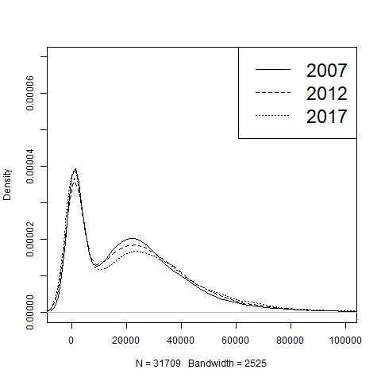

\newpage 
\tableofcontents 
\listoffigures
\listoftables
\newpage


# Einleitung

Die wachsende Ungleichheit in der Gesellschaft und das „Schrumpfen“ der Mittelschicht sind mediale Dauerbrenner. Während 1995 noch 39 Prozent der Bevölkerung die Einkommensverteilung als gerecht empfand, waren es 2013 nur noch 18 Prozent [@bertels2013]. Sind dies subjektive Phänomene oder werden die, die bereits überduchschnittlich verdienen tatsächlich immer reicher und driftet damit die Gesellschaft auseinander? Diese Fragestellung ist kein allein deutsches Phänomen, sondern wird weltweit thematisiert. Während der letzten Monaten des Jahres 2018 brachten in Frankreich die „Gelbwesten“ das Thema Ungleichheit in die Nachrichten [@Gelbwest16:online]. In der Bundesrepublik löste die Aussage des Kandidaten für den CDU Parteivorsitz Friedrich Merz, dass er mit einem Einkommen von rund 1 Millionen Euro der Mittelschicht angehöre, Diskussionen aus [@Friedric57:online]. 

In der folgenden Arbeit werden anhand der EU-Statistik über Einkommen und Lebensbedingungen (EU Statistics on Income and Living Conditions – EU-SILC) von 2005 bis 2017 die Ungleichheit und Verteilung und die Entwicklung der deutschen Mittelschicht betrachtet. In der wissenschaftliche Debatte herrscht Einigkeit über wachsende Einkommensungleichheit bis circa 2005 (@feld2016jenseits, @biewen2017did, @horn2018entstand, @grabka2017realeinkommen und weitere). Für die darauf folgenden Jahre gibt es verschiedene Interpretationen. So sieht @biewen2017did  keine Fortsetzung des Trends nach 2005, während @horn2017tun einen gedämpften, jedoch weiteren Anstieg beobachtet. Zwar ist in den letzten Jahren die Einkommensungleichheit unter Betrachtung der gesamtgesellschaftlichen Entwicklung nicht stark gewachsen. Unsere These ist, dass sich unter dieser scheinbar ausgeglichenen Entwicklung verschiedene Trends verbergen. Dazu gehört ein Rückgang der Mittelschicht.

Die Arbeit gliedert sich in zwei Teile. Zunächst wird die Entwicklung der Einkommenungleichheit zwischen 2005 und 2017 anhand von geläufigen Ungleichheitsndikatoren, wie Lorenzkurve, Gini-Koeffizient, P80/P20-Ratio und der Einkommensanteil der reichsten zehn Prozent, betrachtet. Anhand eines Vergleichs unterschiedlicher Einkommenskonzepte (Pre-tax factor income, Pre-tax national income und Post-tax disposable income) wird insbesondere auf die Bedeutung des staatlichen Transfersystems für die Ungleichheit eingegangen. 

Der zweite Teil der Arbeit konzentriert sich auf die Entwicklung der deutschen Mittelschicht. Da die bereits vorhandene Literatur über die deutsche Mittelschicht sich häufig mit dem subjektiven Empfinden der Bevölkerung auseinandersetzt (siehe z.B. @goebel2010polarisierung, @schoneck2011gefuhlte), wird hier der Schwerpunkt auf die quantitative Analyse gelegt. Durch die Komplexität des Themas haben wir uns dazu entschieden, nicht nur die gesamte Bevölkerung auszuwerten, sondern verschiedene Untergruppen und ihre Entwicklung. Neben der gesamten Bevölkerung werden Single Haushalte, Haushalte mit zwei Kindern und Personen über 65 Jahre gesondert ausgewertet. Diese Analyse zielt darauf ab herauszufinden, ob eine eventuelle Veränderung der Mittelschicht für die gesamte Bevölkerung ähnlich von statten geht oder ob Unterschiede nur auf Veränderungen in einer Untergruppe zurückzuführen sind. Wir verwenden hierfür das verfügbare Einkommen unter Berücksichtigung der staatlichen Transferleistungen. 

Beide Teile der Arbeit gliedern sich in die folgenden Unterpunkte: Zunächst wird die vorhandene Literatur zu dem Thema diskutiert, danach werden Berechnungen und Definitionen erklärt. Zum Abschluss werden jeweils die Ergebnisse Präsentiert. Die Arbeit schließt mit einer Zusammenfassung der wichtigsten Erkenntnisse.

# Entwicklung der Ungleichheit in Deutschland, allgemeine Ungleichheitsindikatoren 

## Literaturdiskussion 

Zahlreiche Veröffentlichungen beobachten steigende Einkommensungleichheit in Deutschland seit Beginn des 21. Jahrhundert bis circa 2005 (@feld2016jenseits, @biewen2017did, @horn2018entstand, @grabka2017realeinkommen und weitere). Über das Bild nach 2005 herrscht Uneinigkeit.

@biewen2017did bestätigen die steigende Ungleichheit bis 2005 und sehen keine Fortsetzung dieses Trends nach 2005. In ihrem Artikel von 2012 nannten Biewen und Juhasz die wachsende Ungleichverteilung der Arbeitseinkommen als Hauptursache für die wachsende Einkommensungleichheit zwischen 1999/2000 und 2005/2006. Jedoch sollen auch Änderungen in den Arbeitsergebnissen und dem Steuersystem dazu beigetragen haben [@biewen2012understanding].

Auch @grabka2017realeinkommen argumentieren, dass die Einkommensungleichheit nach 2005 zunächst nicht weiter zunahm, beobachten jedoch einen erneuten Anstieg ab 2012. Insgesamt sei das verfügbaren Einkommen der privaten Haushalte in Deutschland von 1991 bis 2014 real, also unter Berücksichtigung der Preisentwicklung, um zwölf Prozent gestiegen. Jedoch verlief die Entwicklung für verschiedene Einkommensgruppen unterschiedlich. Die mittleren Einkommen sind demnach um mehr als acht Prozent gestiegen, die höchsten Einkommen legten um bis zu 26 Prozent zu. Die unteren Einkommen gingen hingegen real zurück. Auch das Risiko, arm zu sein, sei zuletzt wieder gestiegen.

@horn2017tun beobachtet hingegen einen gedämpften, jedoch weiteren Anstieg nach 2005. Er nennt die Umverteilung zugunsten Kapitaleinkommen, höhere Ungleichheit innerhalb der Lohneinkommen, sowie eine regressive Steuer und Abgabenpolitik als Hauptursachen. Abgeschwächt wurde die Zunahme in der Einkommensungleichheit, laut @horn2014wirtschaftskrise, durch den starken Einbruch der Kapitaleinkommen während der Wirtschaftskrise. Die Zunehmende Bedeutung von Kapitaleinkommen hatte besonders vor der Krise die Einkommensungleichheit vorangetrieben.  

Laut @jessen2016has hätten, gemessen am Gini-Koeffizienten, Steuer- und Transferreformen einen Ungleichheits-reduzierenden Einfluss gehabt. Dieser Effekt sei jedoch durch Änderungen im Arbeitsangebot ausgeglichen worden. Sie sieht daher Änderungen in der Gesellschaft als Ursache der steigenden Einkommensungleichheit zwischen 2002 und 2011.

Dieser Artikel trägt zur der Diskussion über die Entwicklung der Ungleichheit in Deutschland speziell ab 2005 bei. Vorhergegangenen Studien decken einen Zeitraum bis 2016 ab. Wir erweitern diese Spanne mit Daten für 2017. Betrachtet werden drei verschiedene Einkommenskonzepte. Die Berechnungen und Ergebnisse werden in den folgenden Abschnitten erläutert.


## Daten und Berechnungen
 
Als Datengrundlage verwenden wir die EU-Statistik über Einkommen und Lebensbedingungen (EU Statistics on Income and Living Conditions – EU-SILC) von 2005 bis 2017. Zur Berechnung der Ungleichheitsentwicklung in Deutschland wurden drei verschiedene Einkommenskomponenten herangezogen. Das vorsteuerliche Faktoreinkommen (Pre-tax factor income) umfasst Arbeits- und Vermögenseinkommen. Die entsprechenden Ungleichheitsindikatoren geben wieder, wie hoch die Ungleichheit in Deutschland wäre, gäbe es kein öffentliches Transfersystem. Das Pre-tax national income erfasst zusätzlich Pensionen und Arbeitslosengeld. Das nachsteuerliche, verfügbare Einkommen (Post-tax disposable income) zeigt, wie der Staat die Verteilung der verfügbaren Einkommen durch Steuern und Sozialleistungen beeinflusst. Diese Einkommenskonzepte wurden auf jeweils zwei unterschiedliche Arten aufgeteilt: 1. Alle Einkommensgrößen werden äquivalisiert durch alle Haushaltsmitglieder geteilt (equal sharing of resources within household) und 2. die personenbezogenen Einkommensgrößen bleiben den entsprechenden Personen zugeordnet, die Haushalsgrößen werden durch Haushaltsmitglieder geteilt, die älter als 19 Jahre sind (partial sharing of resources). Einkommenskomponenten unter Null wurden von der Berechnung der Indikatoren ausgeschlossen. Zu beachten ist, dass es über die Jahre zu Änderungen in der Definition der EU-SILC-Daten kam. Damit ist der Vergleich zwischen den Jahren nicht uneingeschränkt möglich, dennoch lassen sich daraus interessante Entwicklungen ablesen.   

## Graphische Betrachtung

Die Verteilung der Pre-tax factor incomes zeigt, dass die meisten Einkommen in dem Bereich zwischen knapp unter 0 Euro und 40.000 Euro pro Jahr liegen (Abbildung 1 bis 3). Bei den ersten beiden Grafiken wurden die Einkommen durch alle Haushaltsmitglieder geteilt.  Abbildung 2 betrachtet den Bereich der besonders häufigen Einkommen genauer. Daraus lässt sich erkennen: Am häufigsten sind Einkommen unter 6.000 Euro. Für 2007 und 2017 ist der Bereich etwas höher als für 2012. Ein zweiter "Hügel" erstreckt sich zwischen 10.000 Euro und 35.000 Euro. In den Jahren 2012 sind geringe Einkommen weniger häufig als 2007, die Kurve wird flacher. Jedoch nähert sich die Verteilung 2017 wieder der von 2007 an und der Anteil geringerer Einkommen steigt an. Bleiben die personenbezogenen Einkommen den jeweiligen Personen zugeordnet (Abbildung 3), erhöht sich der Anteil der Menschen mit einem Einkommen unter 6.000 Euro, da es in dieser Aufteilung einen geringeren Ausgleich innerhalb eines Haushaltes zum Beispiel bei Ehepartner/innen gibt. Wieder ist der Anteil geringerer Einkommen im JAhr 2012 etwas niedriger als 2007 und 2017.

Beim Post-tax disposable income werden die staatlichen Transfersysteme berücksichtigt (Abbildung 4 bis 6). Die ersten beiden Grafiken beziehen sich auf eine Aufteilung der Einkommen auf alle Haushaltsmitglieder, Abbildung 6 enthält die Aufteilung auf erwachsene Haushaltsmitglieder. Durch die Transferleistungen verschiebt sich der "Hügel" nach rechts. Negative Einkommen sind deutlich weniger häufig. Die häufigsten Einkommen liegen nun zwischen 10.000 Euro und 40.000 Euro. Ingesamt liegen die verschiedene Jahre hier näher beieinander. Zwischen 2007 und 2017 flacht die Kurve leicht ab wenn alle Einkommen dur alle Haushaltsmitglieder geteilt werden. In Abbildung 6, bei der teilweisen Ausfteilung der Einkommen, ist dieser Trend gegenläufig. Der Hügel zwischen 0 Euro und 40.000 Euro wird zwischen 2007 und 2017 etwas höher. Jedoch gibt es 2007 eine größere Konzentration der Einkommen am linken Rand des Hügels, diese schwächt sich über 2012 bis 2017 ab.  

Insgesamt haben niedrigere Einkommen seit 2007 abgenommen, was einen ungleichheits-verringernden Effekt hat. Die Auswirkungen auf andere Ungleichheitsindikatoren ist allein durch die Betrachtung der Verteilung nicht eindeutig und wird im folgenden Abschnitt anhand der Ungleichheitsindikatoren aufgeschlüsselt. 

In Abbildung 7 und 8 sind die Lorenzkurven der verschiedenen Einkommenskonzepte für 2017 abgebildet. Damit lässt sich der ausgleichende Effekt des Transfersystems beobachten. Abbildung 7 enthält die Einkommenskonzepte für eine gleichmäßige Einkommensaufteilung innerhalb der Haushalte, Abbildung 8 die personenabhängige Aufteilung für Erwachsene. Die diagonale Linie stellt die ideale Gleichverteilung dar. Wie erwartet sind beim Pre-tax factor income ohne Transferleistungen die Einkommen am wenigsten gleich verteilt. Das Post-tax disposable income erreicht die "fairste" Einkommensverteilung. Besonders drastisch ist der Unterschied zwischen "Pre-tax factor income" und den Einkommen nach einer Umverteilung in Abbildung 8 bei der personenabhängigen Einkommensaufteilung. Dagegen ist die Veränderung zwischen "Pre-tax national income" und "Post-tax-disposable income" bei der personenabhängigen Einkommensaufteilung geringer. Arbeitslosengelder und Pensionen zeigen also bei der erwachsenen Bevölkerung stärkere Umverteilungen als Steuern. Beim "Pre-tax factor income" erhält die untere Einkommenshälfte nicht einmal zehn Prozent des gesamten Einkommens. Sowohl in Abbildung 7, als auch in Abbildung 8 ist das untere Ende des Pre-tax factor incomes besonders flach und wird stetig steiler. Je höher die Einkommensgruppe, desto schneller steigt ihr Anteil am Gesamteinkommen. 

Die Lorenzkurven zeigen, wie sich die Einkommen durch das staatliche Transfersystem verändern und, dass die Aufteilung der Einkommen auf alle Haushaltsmitglieder zu einer gleichmäßigeren Einkommensverteilung führen. Die zeitliche Entwicklung der Ungleichheitsindikatoren ist wird im nächsten Abschnitt betrachtet. 

##Ergebnisse
Die folgenden Tabellen bilden ab, wie sich die Ungleichheit in Deutschland zwischen 2005 und 2017 verändert hat. Der inflationsbereinigte Mittelwert und der inflationsbereinigte Median des "Pre-tax factor incomes" (Tabelle 1) sind insgesamt zwischen 2005 und 2017 angestiegen. 2006 gab es einen deutlichen Rückgang im Vergleich zum Vorjahr. Zwischen 2008 beziehungsweise 2009 und 2011 sind der Mittelwert und der Median leicht gesunken. Der Gini-Koeffizient stieg bis 2008 an, was auf einen Anstieg der Einkommensungleichheit hindeutet. Nach 2008 ging der Gini-Koeffizient wieder leicht zurück und hat sich insgesamt zwischen 2005 und 2017 kaum verändert. Die P80/P20-Ratio zeigt um wie viel höher das Einkommen der "einkommensstarken" Bevölkerung (80. Perzentil) im Vergleich zur "einkommensschwachen" Bevölkerung (20. Perzentil) ist. Die P80/P20-Ratio zeigt ein wechselhaftes Bild mit recht niedrigen Werten nbis 2009 und einem Peak in den Jahren 2014 und 2015. Insgesamt idt die P80/P20- Ratio 2017 deutlich höher als in dem Jahr 2005. Der Einkommensanteil der reichsten zehn Prozent ist bis 2008 gestiegen danach gab es einen leichten Rückgang, sodass der Wert 2017 auf einem ähnlichen Niveau wie 2005 liegt. Auch bei der personenabhängigen Einkommensaufteilung (Tabelle 2) steigen Mittelwert und Median zwischen 2005 und 2017 insgesamt an, mit erhöhten Einkommenseinbußen im Jahr 2006. Ingesamt ist vor allem der Median deutlich geringer als bei einer gleichmäßigen Aufteilung der Einkommen. Das bestätigt die Beobachtungen der Häufigkeitsverteilungen aus der graphischen Betrachtung, die für die personenbezogene Aufteilung der Einkommen deutlich mehr negative Einkommen aufzeigt. Der Gini-Koeffizient und der Einkommensanteil der oberen zehn Prozent sind bei den erwachsenen Haushaltsmitgliedern insgesamt etwas höher, als unter Einbezug der unter 20-Jährigen. Der Gini-Koeffizient geht in dem gesamten Zeitraum zurück. Die P80/P20-Ratio ist in Tabelle 2 teilweise um ein Vielfaches erhöht und teilweise negative. Die negativen Werte kommen durch ein negatives Einkommen der unteren 20 Prozent der Bevölkerung zustande. Das spiegelt die Beobachtungen der Lorenzkurve (Abbildung 8) aus dem vorherigen Kapitel wieder, die zeigten, dass bei dieser Art der Einkommensaufteilung die unteren Einkommensgruppen besonders wenig Anteil am Gesamteinkommen haben.   

Mittelwert und Median sind beim Pre-tax national income (Tabelle 3 und 4) höher, da hier Pensionen und Arbeitslosengelder berücksichtigt werden. Die Ungleichheit wird dadurch etwas verringert. 2006 sind Mittelwert und Median deutlich niedriger als in den anderen Jahren, ansonsten steigen sie bis 2008 an. In den Folgejahren gibt es nur geringe Veränderungen, jedoch ist insgesamt ein Anstieg zwischen 2005 und 2017 zu beobachten. Die Ungleichheit, gemessen am Gini-Koeffizienten, der P80/p20-Ratio und dem Einkommensanteil der reichsten zehn Prozent, steigt in dem gesamten Zeitraum an. Ein leichter Rückgang ist für alle drei Indikatoren seit 2015 zu beobachten. Bei der personenabhängigen Einkommensaufteilung (Tabelle 4) steigen die Einkommen geringer als bei der gleichmäßigen Aufteilung. Der Gini-Koeffizient hat sich insgesamt zwischen 2005 und 2017 nicht viel verändert. Die P80/P20-Ratio geht hier sogar leicht zurück und enthält im Gegensatz zum "Pre-tax-factor income" keine negativen Werte mehr. Der Einkommensanteil der reichsten zehn Prozent der Bevölkerungsteigt bis 2008 insgesamt an, bleibt dann relativ konstant und ist 2017 wieder etwas niedriger. 

Für das "Post-tax disposable income" (Tabelle 5 und 6) sind Mittelwert und Median etwas niedriger als bei den vorsteuerlichen Einkommenskonzepten. Mit den Steuern und Transferzahlungen wird die Ungleichheit in den Einkommen bei einer gleichmäßigen Aufteilung der Einkommen innerhalb der Haushalte verringert, wie Gini-Koeffizient, P80/P20-Ratio und der Einkommensanteil der reichsten zehn Prozent zeigen. Medianeinkommen und Mittelwert steigen beim "Post-tax disposable income" jeweils zwischen 2005 und 2017. Zwischen 2007 und 2014 gibt es jeweils keine große Veränderung in den Einkommen, seit 2014 gibt es wieder einen leichten Anstieg. Die geringere Veränderung zwischen 2007 und 2014 zeigt sich auch beim Gini-Koeffizient und dem Einkommensanteil der reichsten zehn Prozent. Beide Werte gehen ab 2014/2015 leicht zurück. Bei der gleichmäßigen Aufteilung der Einkommen innerhalb der Haushalte steigt die P80/P20-Ratio leicht an. Das Einkommen der "einkommensstärkeren" Bevölkerung war circa vier bis fünf mal höher als das der "einkommensschwächeren" Bevölkerung. Bei der personenbezogenen Aufteilung sind alle Werte für die P80/P20-Ratio negativ. Das Einkommen der "Einkommensschwächeren" war hier negativ. Das könnte vorallem durch Selbständige verursacht werden.

Zusammenfassend lassen sich folgende Trends ausmachen: Median und Mittelwert der verschiedenen Einkommenskonzepte sind zwischen 2005 und 2017 gestiegen. Eine Stagnation der Einkommensungleichheit nach 2005, wie von @biewen2017did beschrieben, kann hier nicht bestätigt werden. Vielmehr steigt die Ungleichheit gemessen am Gini-Koeffizient und dem Einkommensanteil der reichsten zehn Prozent bis zum Krisenjahr 2007. Das passt zu der Darstellung von @horn2017tun der beschreibt, dass durch den Einbruch der Kapitaleinkommen die Ungleichheit während der Finanzkrise weniger stark gewachsen ist. Das Jahr 2006 stellt bei allen Indikatoren einen Ausreißer dar. Mit diesbezüglichen Interpretationen möchten wir uns hier zurückhalten, da das auf Änderungen in den Definitionen der verwendeten Variablen von Eurostat beruhen könnte. Nach 2007/2008 verändern sich die meisten Werte bis 2014 insgesamt nur mehr wenig. Für einzelne Jahre ist ein Anstieg zu beobachten, etwa von 2012 auf 2013, wie schon von @grabka2017realeinkommen beobachtet. Ab 2014 geht die Ungleichheit etwas zurück. Geringere Einkommensgruppen scheinen in diesem Zeitraum relativ von den steigenden Einkommen profitiert zu haben. Die Unterschiedlichen Beobachtungen in der Literatur für die Jahre nach 2005 sind also vor allem auf unterschiedliche Betrachtungszeiträume zurückzuführen, aber auch auf unterschiedliche Indikatoren. Um die Tendenzen in den mittleren Einkommenskategorien besser verstehen zu können, wird in den nächsten Abschnitten die Mittelschicht mit einer Einteilung in oberer, strikten und unterer Mittelschicht genau betrachtet.  

# Die Entwicklung der Mittelschicht in Deutschland

Die Mittelschicht macht in Deutschland den größten Teil der Bevölkerung aus. Seit Jahren wird in Deutschland jedoch das „Schrumpfen“ der Mittelschicht diskutiert @grabka2008schrumpfende. Im weiteren Verlauf betrachten wir die Entwicklung der Mittelschicht zwischen 2005 und 2017. Die Komplexität der Definition der Mittelschicht wurde spätestens deutlich durch die Aussage des Kandidaten für den CDU Parteivorsitz Friedrich Merz. Mit einem jährlichen Einkommen von rund 1. Millionen Euro zählt er sich zur gehobenen Mittelschicht[@Friedric57:online]. Merz beruft sich darauf, dass die Mittelschicht keine rein ökonomische Größe ist, sondern durch andere Werte wie Fleiß und Disziplin definiert wird. Das Hauptaugenmerk dieser Arbeit wird durch die Verwendung von EU-SILC geprägt, welche die Einkommensdaten verschiedener Haushalte in Deutschland erfasst. Dies hat zur Folge, dass der Schwerpunkt der Betrachtung auf die ökonomische Komponente gelegt wird und weniger auf die soziologischen Eckpunkte der Mittelschicht. Definiert wird die Mittelschicht auf Grundlage des IW Köln, wonach die Mittelschicht im engeren Sinne über ein Einkommen von 80 bis 150 Prozent des Medianeinkommens verfügt [@niehues2017mittelschicht]. Im Folgendem wird zunächst ein kurzer Überblick über aktuelle Literatur zu dem Thema Mittelschicht gegeben und welche verschiedenen Ansätze der vorliegenden Thematik relevant sind. 


## Literaturdiskussion

@grabka2016schrumpfender beschreibt in seiner Arbeit die Entwicklung der Mittelschicht bis in das Jahr 2009, was eine passende Ergänzung zu der Auswertung der uns vorliegenden EU-Silc Daten ist. So stellt er fest, dass der Median der Einkommensmitte in Westdeutschland von 1983 bis 1991 um zehn Prozent steigt, während für Gesamtdeutschland bis zum Jahr 2001 nur ein Anstieg um vier Prozent festzustellen ist. Der Anstieg des Median lässt einzeln betrachtet keinen Schluss auf die Veränderung der Mittelschicht zu. Vielmehr muss hier der gesamte Bevölkerungswachstum berücksichtigt werden. Die Anzahl der Erwachsenen Bundesbürger/innen hat sich vom Jahr 1983 um 4 Millionen auf 68 Millionen in dem Jahr 2013 erhöht. Mit dem Anstieg der Bevölkerung und dem Anstieg des Medians der Einkommensmitte ist es überraschend, dass die mittlere Einkommensgruppe in der Vergangenheit rückläufig ist. In dem Jahr 1983 beträgt der Anteil der mittleren Einkommensgruppe an der Erwachsenenbevölkerung noch 62 Prozent, nimmt aber auf 57 Prozent in dem Jahr 2001 ab, bis zu dem Jahr 2013 erfolgt eine weitere Abnahme auf 54 Prozent. Die Entwicklung der Mittelschicht in Deutschland wird daher von @niehues2017mittelschicht in drei verschiedene Phasen unterteilt. Die erste Phase ist geprägt von einer Ausweitung der Mittelschicht nach dem Mauerfall, die neuen Bundesländern nähern sich der Wirtschaftsleistung der westdeutschen Bundesländer an. In der zweiten Phase ab 1997 folgt ein Schrumpfen der Mittelschicht bis in die Mitte der 2000 Jahre, bis in der dritten Phase die Mittelschicht konstant bleibt. 

Weitere Erkenntnisse zu der deutschen Mittelschicht werden von @lengfeld2009angst in seiner Längsschnittanalyse im Jahr 2009 getroffen, welche ausführlich die vorherrschende Abstiegsangst der deutschen Mittelschicht behandelt. Die Angst den gesellschaftlichen Status zu verlieren wird von @goebel2010polarisierung aufgegriffen. Er kommt zu dem Ergebnis, dass in den Jahren 2000 bist 2009 die Unterschiede zwischen den gesellschaftlichen Schichten gewachsen ist. So gab es bei den oberen Schichten Zuwächse im Vermögen während bei den Geringverdienern absolute Verluste auftraten. Wenige Personen schafften den Aufstieg in eine obere Schicht, aber viele sind in eine untere Schicht abgerutscht. Eine weitere Arbeit die zu den selbigen Resultaten kommt wurde von @bosch2015mittelschicht veröffentlicht. Hier wird ebenfalls das Schwinden der deutschen Mittelschicht und die Ausweitung der Geringverdiener mit Mini-Jobs und prekären Beschäftigungen festgestellt. Die Statusangst der Mittelschicht wird darüber hinaus bei @schoneck2011gefuhlte thematisiert mit der Conclusio, dass die Angst der Mittelschicht nicht auf eine Unterversorgung zurückzuführen ist, sondern dass das gesellschaftliche Ideal von Aufstieg und Wohlstand nicht mehr gültig ist. 

Im Unterschied zu den vorliegenden Arbeiten, werden wir nicht allein die Mittelschicht im engeren Sinne betrachten, sondern insbesondere auf die obere und untere Mittelschicht eingehen. Damit wird das Phänomen der schwindenden Mittelschicht genau aufgeschlüsselt. Darüber hinaus wird untersucht, wie sich der Anteil der Mittelschicht für Menschen aus bestimmten Haushaltskonztelationen verändert hat. 


## Definitionsmöglichkeiten zur Mittelschicht 


###Sozio-ökonomische Definition 

Die gesellschaftlichen Schichten können neben dem Einkommen durch andere qualitative Faktoren unterschieden werden, über welche hier ein kurzer Überblick gegeben wird. Im weiteren Verlauf dieser Arbeit wird dann ausführlich die Unterscheidung anhand des Einkommens diskutiert. @niehues2013arm verwendet die soziokulturelle Abgrenzung der Schichten nach der IW Köln. Dabei wird Anhand des beruflichen Werdegangs des/r Haupteinkommensbeziehers/in die gesellschaftliche Schicht eines Haushaltes festgemacht. Dabei ist eine Voraussetzung für die Mittelschicht, das Erlangen eines Berufsabschlusses, des weiteren gehören Facharbeiter/innen, Meister/innen und qualifizierte Angestellt der Mittelschicht an. Lehrer/innen gehören noch der Mittelschicht an, während Studiendirektor/innen und Lehrpersonal an Universitäten bereits der Oberschicht zugerechnet werden. Allerdings können auch durch diese Methode Verzerrungen entstehen. Abgesehen von der beruflichen Einteilung, könnte man eine ausführliche Definition der Mittelschicht anhand @bourdieu1987feinen Habitus Theorie vornehmen, d.h. wie sich anhand der verschiedenen Kapitalarten die Mittelschicht der Gesellschaft definiert. 

Wir konzentrieren uns bei den vorliegenden Berechnungen auf eine ökonomische Definition der Mittelschicht, wie sie in dem folgenden Teil beschrieben ist. Eine umfassende soziologische Betrachtung würde eine qualitative Untersuchung voraussetzen, was hier nicht vorgenommen werden kann. 

### Ökonomische Definition

Bei der Mittelschicht handelt es sich, wie die Bezeichnung bereits vermuten lässt, um die Mitte der Gesellschaft. Die Personen sind weder armutsgefährdet noch außergewöhnlich vermögend. Die Unterteilung des IW Köln unterscheidet die Gesellschaft in fünf verschiedene Gruppen [@niehues2017mittelschicht]. Der Teil der Gesellschaft der ein Einkommen unter 60 Prozent des Medianeinkommens bezieht gilt als armutsgefährdet. Die Einkommensschwachen und untere Mitte verfügt über 60 Przent bis 80 Prozent des Medianeinkommens. Die Mitte im engeren Sinne enthält Menschen mit 80 Prozent bis 150 Prozent des Medianeinkommens. Die wohlhabenden Schichten spalten sich auf in die einkommensstarke/ obere Mitte mit 150 Prozent bis 250 Prozent des Medians und die Einkommensreichen mit über 250 Prozent des Medianeinkommens. Durch die Auflistung der Unterteilung des IW Köln wird ersichtlich, dass die Definition der Mittelschicht selbst über rein ökonomische Größen sehr breit gefasst ist, im engeren Sinn bezieht die Mittelschicht zwischen 80 Prozent bis 150 Prozent des Median während eine weitere Definition sämtliche Personen zwischen 60 Prozent und 250 Prozent vom Median zu der Mittelschicht zählen würde.
[@niehues2017mittelschicht]


## Ergebnisse

### Mittelschicht in der Gesamtbevölkerung  

Die Auswertungen der Mittelschicht erfolgt durch die Betrachtung des „Post-tax disposable income“. Das „Post-tax dispoable income“ bezeichnet das verfügbare Einkommen nachdem sämtliche Steuern abgezogen wurden und enthält die staatlichen Transferleistungen. Durch die Unterteilung der Mittelschicht in obere, untere und die enge Mitte nach dem IW Köln wird ersichtlich, wie sich die Veränderung der kompletten Mittelschicht zusammensetzt. Die Medianeinkommen für die verschiedenen Gesellschaftsgruppen, wie Single-Haushalte, Personen aus Haushalten mit zwei Kindern und Personen über 65 Jahren, in der Tabelle 8-10 dienen zum Vergleich der Entwicklung des Medianeinkommens mit der Gesamtbevölkerung. Die Zugehörigkeit zu den Mittelschichten wurde jedoch auf Basis des allgemeinen Medianeinkommens berechnet. 

In Tabelle 7 wird die Entwicklung der Mittelschicht in der gesamten Bevölkerung betrachtet. Es zeigt sich, dass das Median Einkommen von 2005 bis 2006 um 1.218 Euro gesunken ist, während wir im gesamten Zeithorizont einen Anstieg von 19.047 Euro im Jahr 2005 auf 21.365 Euro im Jahr 2017 beobachten können. Der Anteil der gesamten Mittelschicht an Bevölkerung nimmt in dem gleichen Zeitraum von 85,77 Prozent auf 81,57 Prozent ab. Die Zusammensetzung der Mittelschicht verschiebt sich über die Jahre stetig. Der Anteil der unteren Mitte erhöht sich im gesamten Zeithorizont von 14,72 Prozent im Jahr 2005 auf 17,00 Prozent im Jahr 2017. Die größte Veränderung erfolgt in den Jahren 2005 bis 2006, in denen sich die untere Mitte um 2,42 Prozent verringert. Dieser „Ausreißer“ in der Entwicklung ist auf die Veränderung des Medianeinkommens im selbigen Zeitraum zurückzuführen. Bis auf die starke Veränderung der Mitte in den Jahren 2005 bis 2007, bleiben die Unterschiede zwischen den einzelnen Jahren meistens gering und bewegen sich deutlich unter einem Prozent. 

Die obere Mittelschicht verändert sich gegenläufig zu der bereits diskutieren unteren Mitte. In den Jahren 2005 bis 2007 ist auch hier ein „Ausreißer“ ersichtlich. In den Jahren 2005 bis 2006 erfolgt ein Anstieg des Anteils der oberen Mitte, während sie in der gesamten Betrachtung abnimmt. Der Zuwachs zwischen 2005 bis 2006 um 2,52 Prozent auf 19,88 Prozent, wird durch die Verringerung im Jahr 2007 auf 15.23 Prozent rückgängig gemacht. Zwischen den Jahren 2007 und 2017 bewegen sich die meisten Zuwächse/Verluste der oberen Mittelschicht zumeist unter 0,5 Prozent, bis sie im Jahr 2017 schlussendlich 14,72 Prozent der betrachteten Bevölkerung ausmacht. 

Im Gegensatz zu der oberen und unteren Mitte ist die Veränderung der engen Mitte zwischen den Jahren 2005 bis 2007 weniger dramatisch ausgefallen. Es erfolgt eine Abnahme von 53,69 Prozent im Jahr 2005 auf 53,54 Prozent in 2006 und eine weitere Verringerung des Anteils auf 51,86 Prozent im Jahr 2007. In dem Jahr 2017 macht die enge Mitte in Deutschland hier nur noch 48.86 Prozent der Bevölkerung aus. In der totalen Betrachtung der Mittelschicht von 2005 bis 2017 wird ersichtlich, dass die untere Mitte zunimmt, die obere und eng definierte Mitte hingegen abgenommen haben. In den Daten von 2005 macht die obere und enge Mitte noch 71,05 Prozent der Bevölkerung aus, während in dem letzten Betrachtungsjahr nur noch 64,58 Prozent diesen zugerechnet werden kann. Insgesamt wird der Anteil der Mittelschicht and der Gesamtbevölkerung kleiner, bedigt durch eine Abnahme der oberen und engeren Mittelschicht. Lediglich der Anteil der unteren Mitte erhöht sich. 

Im Folgenden werden Single Haushalte, Haushalte mit zwei Kindern und Personen über 65 Jahre gesondert ausgewertet. Diese Analyse zielt darauf ab herauszufinden, ob die Veränderung der Mittelschicht für die gesamte Bevölkerung ähnlich von statten geht oder ob Unterschiede nur auf Veränderungen in einer Untergruppe zurückzuführen sind.

### Mittelschicht von Alleinlebenden

Die Daten für Einpersonenhaushalte (Tabelle 8) zeigen bei dem Medianeinkommen abermals einen Zuwachs in den Jahren 2005 bis 2017 an. Im Gegensatz zu der Gesamtbetrachtung gibt es hier keine nennenswerte Abweichung in den Jahren 2005 bis 2006. Der Zuwachs im betrachteten Zeitraum beträgt 385,00 Euro, von 17.823 Euro im Jahr 2005 auf ein Median Einkommen von 28.208 Euro im Jahr 2017. Der gesamte Anteil der Mittelschicht an den Einpersonenhaushalten verringerte sich von ursprünglich 72,92 Prozent auf 66.52 Prozent im Jahr 2017. Dies setzt sich zusammen aus einer Verringerung der unteren, oberen und engen Mitte. Während bei der Betrachtung der Mittelschicht der gesamten Bevölkerung Unterschiede in den einzelnen Abstufungen erkennbar waren (Anstieg der unteren Mittelschicht, Abnahme der oberen und engen Mittelschicht), nehmen hier alle Teile der Mittelschicht bis in das Jahr 2017 ab.

Abermals wird ersichtlich, dass bei der unteren Mitte von 2005 bis 2006 eine Verringerung eintritt, von 16,86 Prozent im Jahr 2005 auf 12,54 Prozent im Jahr 2006, diese verläuft ähnlich wie in der gesamten Betrachtung. Im weiteren Verlauf verringert sich dann der Anteil an der gesamten Mittelschicht auf 13.69 Prozent, wobei die jährlichen Veränderungen hier stärker ausfallen als bei der gesamten Bevölkerung. Die untere Mitte zeigt somit den größten Unterschied zwischen den Einpersonenhaushalten und der gesamten Betrachtung. Während bei der gesamten Betrachtung einen Anstieg der unteren Mitte zu beobachten ist, kann hier von einem "Schrumpfen" der unteren Mitte gesprochen werden.

Die obere Mitte verhält sich parallel zu der gesamten Bevölkerung. Von 2005 auf 2006 erfolgt ein Anstieg von 13,75 Prozent auf 19,57 Prozent, während man bis in das Jahr 2017 eine Abnahme auf 13,49 Prozent der Mittelschicht der Einpersonenhaushalte erkennt. 

Die Mitte im engeren Sinne der Single Haushalte zeigt einen Verlust von 1,25 Prozent zwischen 2005 und 2006 an und erholt sich von diesem nicht wieder. Insgesamt sinkt die enge Mitte von 42,31 Prozent im Jahr 2005 auf 39,33 Prozent im Jahr 2017.

### Mittelschicht bei Familien mit zwei Kindern

Die verfügbaren Medianeinkommen von Personen, die in einem Haushalt mit zwei Kindern leben, (Tabelle 9) stiegen von 18.269 Euro im Jahr 2005 um 3.455 Euro auf 21.724 Euro im Jahr 2017. Mit diesem Anstieg konnte diese Bevölkerungsgruppe den größten Anstieg des Medianeinkommens aller betrachteten Gruppen ausweisen. Der Gesamtanteil der Mittelschicht von 2005 bis 2017 verringert sich hier von 88,96 Prozent auf 87,93 Prozent im Jahr 2017. Das erscheint zunächst eine geringe Veränderung zu sein. Betrachtet man jedoch obere, enge und untere Mittelschicht getrennt wird deutlich, dass es auch bei Familien mit zwei Kindern starke Veränderungen gab.

Die untere Mitte verringert sich von 13,79 Prozent in dem Jahr 2005 auf 10,54 Prozent im folgenden Jahr und erholt sich auf 16,37 Prozent im Jahr 2007. Im letzten Jahr des Datensatzes macht die untere Mitte der Personen aus Haushalten mit zwei Kindern 16,86 Prozent an der Bevölkerung aus. 

Der Anteil der oberen Mitte steigt von 16,03 Prozent im Jahr 2005 auf 16,84 Prozent im Jahr 2006, sinkt aber im Jahr 2007 bereits wieder auf 10,79 Prozent ab. Wie bereits in den anderen Teilen der Mittelschicht, bewegen sich die weiteren Veränderungen bis in das Jahr 2013 unter einem Prozent. In dem Jahr 2017 beträgt der Anteil schlussendlich 11,71 Prozent an der Gesamtbevölkerung mit zwei Kindern im Haushalt und ist somit über den betrachteten Zeitraum um 4,32 Prozent gesunken. 

Die eng definierte Mitte zeigt eine große Veränderung, nicht wie bei der oberen und unteren Mitte im Jahr 2005 bis 2006, sondern in dem Jahr darauf. So sinkt der Anteil der engen Mitte von 60,14 Prozent im Jahr 2007 auf 57,55 Prozent im Jahr 2008. Eine weitere Auffälligkeit ist die Veränderung von 2015 bis 2016 mit 56,74 Prozent auf 54,91 Prozent, welche im letzten Jahr der Betrachtung wieder auf 59,36 Prozent ansteigt. Der Anteil der engen Mitte an der Gesamtbevölkerung mit zwei Kindern steigt somit im betrachteten Zeitraum von 2005 bis 2017 um 0,23 Prozent von anfänglich 59,13 Prozent auf 59,36 Prozent im Jahr 2017.

Bei den Haushalten mit zwei Kindern hat sich die gesamte Mittelschicht nur im geringen Maße verändert, dies kommt durch die gegenläufigen Effekte der unteren und oberen Mittelschicht. Während die eng definierte Mitte, sich kaum verändert nimmt die obere Mittelschicht ab und die untere Mitte wächst. 

### Mittelschicht der Personen über 65 Jahren 

Das Medianeinkommen der Personen über 65 Jahren (Tabelle 10) nimmt in den Jahren 2005 bis 2017, wie bereits bei den anderen Gruppen, zu. Es erhöht sich um 688 Euro von 18.145 Euro im Jahr 2005 auf 18.883 Euro im Jahr 2017. Der gesamte Anteil der Mittelschicht bei den „älteren Personen“ nimmt in dem Betrachtungszeitraum von 85,09 Prozent im Jahr 2005 auf 82,65 Prozent im Jahr 2017 ab. 

Die untere Mitte verändert sich hier am stärksten. Besonders in den Jahren 2006 bis 2007 gibt es einen hohen Anstieg von 4,91 Prozent. Während im Jahr 2006 der Anteil an der Gesamtheit noch 15,96 Prozent beträgt, erhöht sich dieser auf 20,87 Prozent im Jahr 2007. Im Betrachtungszeitraum 2005 bis 2017 nimmt die untere Mitte bei den Personen über 65 von 17,99 Prozent im Jahr 2005 auf 23,08 Prozent zu, dies entspricht einem Anstieg von 5,09 Prozent. 

Die obere Mitte zeigt bei den älteren Personen eine „starke“ Abnahme über den betrachteten Zeitraum. Während im Jahr 2005 noch 12,62 Prozent der oberen Mitte zugerechnet werden, ist dies im Jahr 2017 nur noch für 9,62 Prozent der Personen der Fall. Zum wiederholten Male zeigt sich eine auffällige Veränderung zwischen den Jahren 2006 und 2007. Während im Jahr 2006 noch 15,10 Prozent der oberen Mitte zugerechnet werden, sinkt dieser Anteil um 3,41 Prozent auf 11,69 Prozent im Jahr 2007. 

Die Veränderungen der engen Mitte fällt bei den Personen über 65 Jahren deutlich stärker aus, verglichen mit Single Haushalten und Haushalten mit zwei Kindern. Von 2005 bis 2017 sinkt der Anteil von 54,80 Prozent im Jahr 2005 auf 59,95 Prozent im Jahr 2017, was mit einer Veränderung von 4,53 gleichzusetzen ist. Während in den meisten Jahren eine relativ geringe Veränderung zu beobachten ist, sieht man deutlich den Unterschied zwischen den Jahren 2006 und 2007. Im Jahr 2006 sind noch 55,26 Prozent der älteren Personen der engen Mittelschicht zuzurechnen, während im Jahr 2007 nur noch für 51,29 Prozent zutrifft. Der Anteil der engen Mitte sinkt somit zwischen diesen Jahren um 3,97 Prozent. 

Insgesamt hat sich bei Personen über 65 Jahren die untere Mitte am stärksten verändert mit einem Anstieg von fast 5 Prozent. Die obere und engere Mitte haben dagegen deutlich abgenommen. Im Vergleich zu den bereits diskutierten Bevölkerungsgruppen zeigt sich bei Personen über 65 Jahren für obere, untere und enge Mittelschicht ein besonders drastischer Wandel.  

### Zusammenfassung der Ergebnisse der Mittelschicht

Unsere Ergebnisse bestätigen einen Rückgang der Mittelschicht, wie unter anderem von @goebel2010polarisierung, @bosch2015mittelschicht und @schoneck2011gefuhlte beschrieben. Bereits in der ersten Auswertung der Daten ohne die Unterteilung in verschiedene Untergruppen wird deutlich, dass der Gesamtanteil der Mittelschicht an der Bevölkerung in den Jahren 2005 bis 2017 abgenommen hat. Darüber hinaus konnten wir mit der Aufspaltung in obere, untere und eng definierte Mittelschicht zeigen, dass diese Abnahme zumeist durch eine Verringerung der oberen und eng definierten Mittelschicht erfolgt. Die untere Mittelschicht, welche von @niehues2017mittelschicht als einkommensschwach bezeichnet wird, verhält sich dazu gegenläufig und nimmt zu. Die Ausnahme bei der Zunahme der unteren Mittelschicht bilden die Single Haushalte in der diese ebenfalls abnehmen. 

Dieses Muster, dass sich die obere Mittelschicht verringert aber der untere Anteil der Mittelschicht über die Jahre wächst, kann man für Haushalte mit zwei Kindern und ältere Personen beobachten. Auffällig ist die Verringerung der Mittelschicht bei den Single Haushalten, welche sich bei sämtlichen Untergruppen zeigt. Hier nimmt die enge und untere Mittelschicht deutlich ab während die obere Mittelschicht um geringe 0,26 Prozent gesunken ist. Lediglich Haushalte mit zwei Kindern zeigen einen Anstieg bei der eng definierten Mitte, welcher 0,23 Prozent beträgt.
Im Gegensatz dazu sind bei den Personen über 65 Jahre die größte Veränderung zu beobachten. Nicht nur wächst die untere Mittelschicht mehr als bei den Vergleichsgruppen, auch die obere und enge Mittelschicht nimmt stärker ab. Es zeigt sich bei den älteren Personen, die mit 65 Jahren zumeist im Rentenalter sind, dass die gesamte Mittelschicht lediglich um 2,44 Prozent abgenommen hat. Diese „geringe“ Abnahme der Mittelschicht der älteren Bevölkerung basiert aber auf der starken Zunahme der unteren Mittelschicht welche die Verluste bei der engen und oberen Mittelschicht ausgleicht.

# Zusammenfassung und Schlussbemerkungen

Einkommensungleichheit in Deutschland ist immer wieder Gegenstand öffentlicher Debatten [@ungleich2018:online]. Während 1995 noch 39 Prozent der Bevölkerung die Einkommensverteilung als gerecht empfand, waren es 2013 nur noch 18 Prozent [@bertels2013]. Gerade das schwinden der Mittelschicht erhielt in letzter Zeit häufig mediale Aufmerksamkeit [@wiwo2016:online].

In der wissenschaftliche Debatte herrscht Einigkeit über wachsende Einkommensungleichheit bis 2005 (@feld2016jenseits, @biewen2017did, @horn2018entstand, @grabka2017realeinkommen und weitere). Für die darauf folgenden Jahre gibt es verschiedene Interpretationen. So sieht @biewen2017did  keine Fortsetzung des Trends nach 2005, während @horn2017tun einen gedämpften, jedoch weiteren Anstieg beobachtet. Unser Artikel trägt zur der Diskussion über die Entwicklung der Ungleichheit in Deutschland speziell ab 2005 bei. Zu diesem Zweck wurde die Einkommensentwicklung mit der EU-Statistik über Einkommen und Lebensbedingungen (EU Statistics on Income and Living Conditions – EU-SILC) von 2005 bis 2017 betrachtet. Vorhergegangenen Studien decken lediglich einen Zeitraum bis 2016 ab. Die Definition einiger Variablen in dem Datensatz hat sich über den Zeitraum verändert. Damit sind die Ergebnisse für einzelne Jahre nicht eins zu eins miteinander vergleichbar. Trotz der leichten Verzerrung lassen sich grobe Trends ablesen und bieten aufschlussreiche Ergebnisse. @hauser2007probleme kritisiert, dass in Deutschland die EU-SILC Befragung per Telefon und nicht wie üblich persönlich erfolgt. Da jedoch kein Ländervergleich vorgenommen wird sollte das die Ergebnisse nicht weiter verzerren. 

Zur Berechnung der Ungleichheitsentwicklung in Deutschland wurden drei verschiedene Einkommenskomponenten herangezogen. Das vorsteuerliche Faktoreinkommen (Pre-tax factor income), das Pre-tax national income und das nachsteuerliche, verfügbare Einkommen (Post-tax disposable income). Im ersten Teil der Arbeit wurde die Entwicklung der Einkommensungleichheitg anhand von allgemeinen Ungleichheits-Indikatoren berechnet. Der zweite Teil bezieht sich auf die Diskussion über eine schwindende Mittelschicht. Die Komplexität der Definition der Mittelschicht machte spätestens die Aussage des Kandidaten für den CDU Parteivorsitz Friedrich Merz deutlich, welcher sich mit einem jährlichen Einkommen von rund einer Millionen Euro zur gehobenen Mittelschicht zählt. Wir stützen unsere Berechnungen auf die Definition der Mittelschicht nach dem IW Köln, wonach die Mittelschicht im engeren Sinne über ein Einkommen von 80 bis 150 Prozent des Medianeinkommens verfügen. Die Mittelschicht im weiteren Sinne umfasst Personen mit 60% und 250% des Medianeinkommens [@niehues2017mittelschicht].  

Die Ergebnisse zeigen, dass Median und Mittelwert der verschiedenen Einkommenskonzepte zwischen 2005 und 2017 insgesamt gestiegen sind. Eine Stagnation der Einkommensungleichheit nach 2005, wie von @biewen2017did beschrieben, kann hier nicht bestätigt werden. Vielmehr steigt die Ungleichheit gemessen am Gini-Koeffizient und dem Einkommensanteil der reichsten zehn Prozent bis zum Krisenjahr 2007. Das passt zu der Darstellung von @horn2017tun der beschreibt, dass durch den Einbruch der Kapitaleinkommen die Ungleichheit während der Finanzkrise weniger stark gewachsen ist. Nach 2007/2008 verändern sich die meisten Werte bis 2014 insgesamt nur mehr wenig. Für einzelne Jahre ist ein Anstieg zu beobachten, etwa von 2012 auf 2013, wie schon von @grabka2017realeinkommen beobachtet. Ab 2014 geht die Ungleichheit etwas zurück. Geringere Einkommensgruppen scheinen in diesem Zeitraum relativ von den steigenden Einkommen profitiert zu haben. Die Unterschiedlichen Beobachtungen in der Literatur für die Jahre nach 2005 sind also vor allem auf unterschiedliche Betrachtungszeiträume zurückzuführen, aber auch auf unterschiedliche Indikatoren. 

Die Ergebnisse bestätigen einen sinkenden Anteil der Mittelschicht zwischen 2005 und 2017 von 53,69 Prozent auf 49,86 Prozent. Durch die Aufspaltung in obere, untere und eng definierte Mittelschicht wird ersichtlich, dass diese Abnahme durch eine Verringerung der oberen und eng definierten Mittelschicht erfolgt. Die untere Mittelschicht, welche von @niehues2017mittelschicht als einkommensschwach bezeichnet wird, verhält sich dazu gegenläufig und nimmt zu. Diese Entwicklung ist kohärent für die betrachteten Untergruppen, nämlich Haushalte mit 2 Kindern und Personen über 65 Jahren. Lediglich Personen die alleine Leben zeigen Unterschiede auf, so ist bei den Single Haushalten eine vergleichsweise geringe Abnahme der oberen, unteren und engen Mittelschicht festzustellen. Die eng definierte Mitte nimmt über alle Untergruppen mit Ausnahme der Haushalte mit zwei Kindern deutlich ab, welche eine geringen Anstieg erfährt. Im Gegensatz dazu sind bei den Personen über 65 Jahre die größte Veränderung zu beobachten, nicht nur wächst die untere Mittelschicht mehr als bei den Vergleichsgruppen auch die obere und enge Mittelschicht nimmt stärker ab. Es zeigt sich bei den alten Personen, die mit 65 Jahren zumeist im Rentenalter sind, dass die gesamte Mittelschicht lediglich um 2,44 Prozent abgenommen hat. Diese verhältnismäßig geringe Abnahme der Mittelschicht der älteren Bevölkerung basiert auf der starken Zunahme der unteren Mittelschicht welche die Verluste bei der engen und oberen Mittelschicht ausgleichen. Das betsätigt unsere These, dass sich hinter der scheinbar gemäßigten Ungleichheitsentwicklung ab Mitte der Nullerjahre verschiedene Trends verbergen. 


# Graphen 
{width=60%}

{width=60%}

{width=60%}

{width=60%}

{width=60%}

{width=60%}

{width=60%}

{width=60%}

#Tabellen

```{r echo=FALSE}
library(knitr)
pre.tax.fac.p1 <- readRDS("tables/GER_pre_tax_fac_p1_table_inflation.RData")
kable(pre.tax.fac.p1, caption = "Pre tax factor income - Equal sharing of resources within household")
```

```{r echo=FALSE}
library(knitr)
pre.tax.fac.p2 <- readRDS("tables/GER_pre_tax_fac_p2_table_inflation.RData")
kable(pre.tax.fac.p2, caption = "Pre tax factor income -  Partial sharing of resources")
```

```{r echo=FALSE}
library(knitr)
pre.tax.nat.p1 <- readRDS("tables/GER_pre_tax_nat_p1_table_inflation.RData")
kable(pre.tax.nat.p1, caption = "Pre tax national income - Equal sharing of resources within household")
```

\newpage 

```{r echo=FALSE}
library(knitr)
pre.tax.nat.p2 <- readRDS("tables/GER_pre_tax_nat_p2_table_inflation.RData")
kable(pre.tax.nat.p2, caption = "Pre tax national income - Partial sharing of resources")
```

```{r echo=FALSE}
library(knitr)
post.tax.p1 <- readRDS("tables/GER_post_tax_p1_table_inflation.RData")
kable(post.tax.p1, caption = "Post tax disposable income - Equal sharing of resources within household")
```

\newpage  

```{r echo=FALSE}
library(knitr)
post.tax.p2 <- readRDS("tables/GER_post_tax_p2_table_inflation.RData")
kable(post.tax.p2, caption = "Post tax disposable income - Partial sharing of resources")
```

```{r echo=FALSE}
library(knitr)
options(digits = 4)
middleclass.p1 <- readRDS("tables/GER_middleclass_p1.RData")
kable(middleclass.p1, caption = "Post-tax disposable income - Total")
```

\newpage

```{r echo=FALSE}
library(knitr)
options(digits = 4)
middleclass.single <- readRDS("tables/GER_middleclass_single.RData")
kable(middleclass.single, caption = "Post-tax disposable income - Single Living")
```

```{r echo=FALSE}
library(knitr)
options(digits = 4)
middleclass.two <- readRDS("tables/GER_middleclass_two.RData")
kable(middleclass.two, caption = "Post-tax disposable income - Two Children")
```

\newpage

```{r echo=FALSE}
library(knitr)
options(digits = 4)
middleclass.old <- readRDS("tables/GER_middleclass_old.RData")
kable(middleclass.old, caption = "Post-tax disposable income - Older")
```

##Literaturverzeichnis