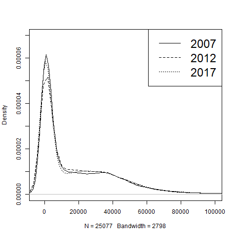
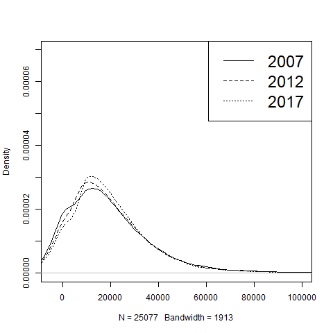

```{r setup, include=FALSE}
knitr::opts_chunk$set(echo = TRUE)
```

Zitieren im Text -> Eckige Klammer [@grabka2016schrumpfender] Eckige Klammer, cheatsheet, R Markdown Knit geht nicht!!   

\newpage

# Einleitung

# Berechnung allgemeiner Ungleichheitsindikatoren

##Daten und Berechnungen
Als Datengrundlage verwenden wir die EU-Statistik über Einkommen und Lebensbedingungen (EU Statistics on Income and Living Conditions – EU-SILC) von 2005 bis 2017. Zur Berechunung der Ungleichheitsentwicklung in Deutschland wurden drei verschiedene Einkommenskomponenten herangezogen. Das vorsteuerliche Faktoreinkommen (Pre-tax factor income) umfasst Arbeits- und Vermögenseinkommen. Die entsprechenden Ungleichheitsindikatoren geben wieder, wie hoch die Ungleichheit in Deutschalnd wäre, gäbe es kein öffentliches Transfersytem. Das Pre-tax national income erfasst zusätzlich Pensionen und Arbeitslosengeld. Das nachsteurliche, verfügbare Einkommen (Post-tax disposable income) zeigt, wie der Staat die Verteilung der verfügbaren Einkommen durch Steuern und Sozialleistungen beeinflusst. Diese Einkommenskonzepte wurden auf jeweils zwei unterschiedliche Arten aufgeteilt: 1. Alle Einkommensgrößen werden in gleichen Anteilen durch alle Haushaltsmitglieder geteilt (equal sharing of resources within household) und 2. die personenbezogenen Einkommensgrößen bleiben den entsprechenden Personen zugeordnet, die Haushalsgrößen werden durch Haushaltsmitglieder geteilt, die älter als 19 Jahre sind (partial sharing of resources). Einkommenskomponenten unter null wurden von der Berechnung der Indikatoren ausgeschlossen. Zu beachten ist, dass es über die Jahre zu Änderungen in der Definition der EU-SILC-Daten kam. Damit ist der Vergleich zwischen den Jahren nicht uneingeschränkt möglich, dennoch lassen sich daraus interesannte Entwicklungen ablesen.   

##Graphische Betrachtung

Die Verteilung der Pre-tax factor incomes zeigt, dass die meisten Einkommen zwischen 0 und 40 000 pro Jahr liegen (Figure 1, Figure 2, Figure 3). Bei den ersten beiden Grafiken wurden die Einkommen durch alle Haushaltsmitglieder geteilt.  Die zweite Grafik (Figure 2) betrachtet den Bereich der besonders häufigen Einkommen genauer. Daraus lässt sich erkennen: Am häufigsten sind Einkommen unter 6 000. Für 2007 ist der Bereich besonders hoch. Ein zweiter "Hügel" erstreckt sich zwischen 10 000 und 30 000. In den Jahren 2012 und 2017 werden geringe Einkommen weniger häufig, die Kurve wird flacher. Jedoch steigen besonders hohe Einkommen, sodass sich das rechte Ende der Einkommensverteilung nach rechts zieht (Figure 1). Das deutet darauf hin, dass der Einkommensanteil der oberen zehn Prozent zugenommen hat. Bleiben die personenbezogenen Einkommen den jeweiligen Personen zugeordnet (Figure 3), erhöht sich der Anteil der Menschen mit einem Einkommen unter 6000, da es in dieser Aufteilung einen geringeren Ausgleich innerhalb eines Haushaltes zum Beispiel bei Ehepartner/innen gibt.

Beim Post-tax disposable income werden die staatlichen Transfersysteme berücksichtigt (Figure 4, Figure 5, Figure 6). Die ersten beiden Grafiken beziehen sich auf eine Aufteilung der Einkommen auf alle Haushaltsmitglieder,  Figure 6 enthält die Aufteilung auf erwachsene Haushaltsmitglieder. Durch die Transferleistungen verschiebt sich der "Hügel" nach rechts. Die häufigsten Einkommen liegen nun zwischen 10 000 und 30 000. Zwischen 2007 und 2017 flacht die kurve ab und verschiebt sich nach rechts. Damit werden niedrigere Einkommen seltener. Jedoch steigen auch bei den Post-tax disposable incomes extrem hohe Werte stark an. In Figure 6 gibt es 2007 eine größere Konzentartion der Einkommen am linken Rand, diese schwächt sich über 2012 bis 2017 ab.  

Insgesamt haben niedrigere Einkommen seit 2007 abgenommen, was einen ungleichheitsveringernden Effekt hat. Besonders extreme Einkommen und damit der Einkommensanteil der oberen zehn Prozent haben sich erhöht. Die Auswirkungen auf andere Ungleichheitsindikatoren ist allein durch die Betrachtung der Verteilung uneindeutig und wird im folgenden Abschnitt anhand der Ungleichheitsindikatoren aufgeschlüsselt. 

In Figure 7 und 8 sind die Lorenzkurven der verschiedenen Einkommenskonzepte für 2017 abgebildet. Damit lässt sich der ausgleichende Effekt des Transfersystems beobachten. Figure 7 enthält die Einkommenskonzepte für eine gleichmäßige Einkommensaufteilung innerhalb der Haushalte, bei Figure 8 die personenabhängige Aufteilung für Erwachsene. Die diagonale Linie stellt die ideale Gleichverteilung dar. Wie erwartet sind beim Pre-tax factor income ohne Transferleistungen die Einkommen am wenigsten gleich Verteilt. Das Post-tax disposable income erreicht die "fairste" Einkommensverteilung. Besonders drastisch ist der Unterschied in Figure 8 bei der personenabhängigen Einkommensaufteilung. Die untere Einkommenshälfte erhält gerade einmalzehn Prozent des gesamten Einkommens. Sowohl in Figure 7, als auch in Figure 8 ist das untere Ende des Pre-tax factor incomes besonders flach und wird stetig steiler. Je höher die Einkommensgruppe, desto schneller steigt ihr Anteil am Gesamteinkommen. Die zeitliche Entwicklung der ungleichheitsindikatoren ist wird im nächsten Abschnitt betrachtet. 

##Ergebnisse
Die folgenden Tabellen zeigen, wie sich die Ungleichheit in Deutschland zwischen 2005 und 2017 verändert hat. Der Mittelwert und der Median des Pre-tax factor incomes (Tabelle 1) ist insgesamt zwischen 2005 und 2017 angestiegen. Lediglich 2006 gab es einen Rückgang im Vergleich zum Vorjahr. Der Gini-Koeffizient stieg bis 2008 an, was auf einen Anstieg der Einkommensungleichheit hindeutet. Nach 2008 ging der Gini-Koeffizient wieder leicht zurück. Die P80/P20-Ratio zeigt um wie viel höher das Einkommen der "einkommenstarken" Bevölkerung (80. Percentil) im Vergleich zur "einkommensschwachen" Bevölkerung (20. Percentil) ist. Die P80/P20-Ratio  stieg nach 2005 zunächst deutlich an und zeigt seither ein wechselhaftes Bild mit einem Peak im Jahr 2011. Der Einlkommensanteil der reichsten zehn Prozent ist seit 2005 stark gestiegen. Auch bei der personenabhängigen Einkommensaufteilung (Tabelle 2) steigen Mittelwert und Median zwischen 2005 und 2017 insgesamt an. Jedoch macht sich die Einkommeneinbußen ab 2006 hier stärker bemerkbar. Bis 2007 sinken die Mittelwert und Median. Erst 2012 können sich die Einkommen wieder auf ein Niveau von vor der Krise erholen. Der Gini-Koeffizient und der Einkommensanteil der oberen zehn Prozent sind bei den erwachsenen Haushaltsmitgliedern insgesamt etwas höher, als unter Einbezug der 20-Jährigen. Die P80/P20-Ratio ist in Tabelle 2 um ein Vielfaches erhöht. Das spiegelt die Beobachtungen der Lorenzkurve (Figure 8) aus dem vorherigen Kapitel wieder, die zeigten, dass bei dieser Art der Einkommensaufteilung die unteren Einkommensgruppen besonders wenig Anteil am Gesamteinkommen haben.   

Mittelwert und Median sind beim Pre-tax national income (Tabelle 3 und 4) etwas höher, da hier Pensionen und Arbeitslosengelder berücksichtigt werden. Die Ungleichheit wird dadurch etwas verringert, ist jedoch insgesamt noch recht hoch. Bis 2007 sinken Mittelwert und Median der Einkommen, danach steigen sie stetig an. Nach 2006 erhöht sich der Gini-Koeffzient sprunghaft und bleibt bis 2013 auf einem relativ hohen Niveau. Bei den personenabhängigen Einkommensaufteilung ist der Anstieg des Gini-Koeffizienten deutlich stärker. Analog dazu verläuft die P80/P20-Ratio. Einkommensanteil der oberen.....

Für das Post-tax disposable income (Tabelle 5 und 6) sind Mittelwert und Median etwas niedriger als bei den vorsteuerlichen Einkommenskonzepten. Damit wird die Ungleicheit in den Einkommen verringert, wie Gini-Koeffizient und P80/P20-Ratio zeigen. 

# Die Entwicklung der Mittelschicht in Deutschland

# Einleitung Mittelschicht 

Im folgendem wird ein kurzer Überblick über aktuelle Literatur zu dem Thema Mittelschicht gegeben und welche verschiedenen Ansätze der vorliegenden Thematik relevant sind. Die Komplexität der Definition der Mittelschicht wurde man sich spätestens bewusst durch die Aussage des Kandidaten für den CDU Parteivorsitz Friedrich Merz welcher sich mit einem jährlichen Einkommen von rund 1. Millionen Euro zur gehobenen Mittelschicht zählt. Merz beruft sich darauf, dass die Mittelschicht keine rein ökonomische Größe ist, sondern auch durch andere Werte wie Fleiß und Disziplin definiert wird. Das Hauptaugenmerk dieser Arbeit wird durch die Verwendung von EU-Silc geprägt welche die Einkommensdaten verschiedener Haushalte in Deutschland erfasst, dies hat zur Folge, dass der Schwerpunkt der Betrachtung auf die ökonomische Komponente gelegt wird und weniger auf die soziologischen Eckpunkte der Mittelschicht. 

Quelle: (https://www.zeit.de/politik/deutschland/2018-11/friedrich-merz-cdu-vorsitz-einkommen Stand 26.12.2016: 21:45 Uhr) 

# Die Mittelschicht im Überblick 

Die gesellschaftlichen Schichten werden neben dem Einkommen noch durch andere qualitative Faktoren unterschieden über welche hier ein kurzer Überblick gegeben wird, im weiteren Verlauf dieser Arbeit wird dann ausführlich die Unterscheidung anhand des Einkommens diskutiert. So verwendet Niehues für die soziokulturelle Abgrenzung der Schichten abermals die, der IW Köln. Die Abgrenzung wird hier Anhand des beruflichen Werdegangs des Haupteinkommensbeziehers eines Haushaltes festgemacht und gilt für den gesamten Haushalt. So ist eine Vorrausetzung für die Mittelschicht, dass erlangen eines Berufsabschlusses, des weiteren gehören Facharbeiter/innen, Meister/innen und qualifizierte Angestellt der Mittelschicht an. Weitergedacht werden hier noch tiefergehende Unterscheidungen getroffen, so gehören Lehrer/innen noch der Mittelschicht an während Studiendirektor/innen und Lehrpersonal an Universitäten bereits der Oberschicht angehören. Es wird ersichtlich, dass die Unterscheidung der Mittelschichten nicht nur durch das Einkommen vorgenommen werden kann sondern auch durch soziokulturelle Faktoren, interessant wäre auch eine ausführliche Definition der Mittelschicht anhand Bourdieus Habitustheorie, was aber für eine weniger quantitative Ausrichtung der hier vorliegenden Arbeit sprechen würde. 
[@niehues2013arm]

# Definition der Mittelschicht nach IW Köln 

Bei der Mittelschicht handelt es sich wie die Bezeichnung bereits vermuten lässt um die Mitte der Gesellschaft, die betroffenen Personen sind weder Armutsgefährdet noch außergewöhnlich vermögend. Für die ökonomische Unterteilung welcher Schicht ein Haushalt bzw. eine Person angehört wird im weiteren die Abgrenzung des Instituts der deutschen Wirtschaft in Köln verwendet. Die Unterteilung des IW Köln unterscheidet unsere Gesellschaft in fünf verschiedene Gruppen. Der Teil der Gesellschaft der von armutsgefährdet ist bezieht ein Einkommen welches unter 60% des Medianeinkommens liegt, während die Einkommensschwachen und untere Mitte zwischen 60%-80% des Medianeinkommens beziehen. Die wirkliche Mitte, welche von Niehues als Mitte im engeren Sinn bezeichnet wird, verfügt über ein Einkommen von 80%-150% vom Median. Die wohlhabenden Schichten spalten sich auf in die einkommensstarke/obere Mitte mit 150%-250% des Medians und die Einkommensreichen mit über 250% vom Medianeinkommen. Durch die Auflistung der Unterteilung des IW Köln wird ersichtlich, dass die Definition der Mittelschicht selbst über rein ökonomische Größen sehr breit gefasst ist, im engeren Sinn bezieht die Mittelschicht zwischen 80%-150% des Median während eine weitere Definition sämtliche Personen zwischen 60% und 250% vom Median zu der Mittelschicht zählen würde
[@niehues2017mittelschicht]

# Die Entwicklung der Mittelschicht in der Vergangenheit 

Ausgehend von der weiterführenden Betrachtung der Mittelschicht ist es unerlässlich zu erörtern wie sich diese in den letzten Jahrzehnten entwickelt hat, ist dies auf verschiedenen Faktoren wie die EU-Krise zurückzuführen oder veränderte sich die Einkommensmitte der deutschen Bevölkerung stetig. Grabka beschreibt in seiner Arbeit die Entwicklung der Mittelschicht bis in das Jahr 2009, was eine passende Ergänzung zu der Auswertung der uns vorliegenden EU-Silc Daten ist. 

So stellt Grabka fest, dass der Median der Einkommensmitte in Westdeutschland von 1983 bis 1991 um 10% steigt während für Gesamtdeutschland bis zum Jahr 2001 nur ein Anstieg um 4% festzustellen ist. Der Anstieg des Median lässt aber einzeln betrachtet keinen Schluss auf die Veränderung der Mittelschicht zu. Die Mittelschicht welche traditionell den stärksten Anteil der Schichten stellt – nicht nur durch subjektive Empfindungen, sondern auch durch objektive quantitative benötigt für genauere Rückschlüsse das Bevölkerungswachstum. Der Anzahl der Erwachsenen Bundesbürger hat sich somit vom Jahr 1983 um 4 Millionen auf 68 Millionen in dem Jahr 2013 erhöht. Mit dem Anstieg der Bevölkerung und dem Anstieg des Medians der Einkommensmitte ist es überraschend, dass die mittlere Einkommensgruppe in der Vergangenheit rückläufig ist. In dem Jahr 1983 beträgt der Anteil der mittleren Einkommensgruppe an der Erwachsenenbevölkerung noch 62%, nimmt aber auf 57% in dem Jahr 2001 ab, bis zu dem Jahr 2013 erscheint eine weitere Abnahme auf 54%. Die Entwicklung der Mittelschicht in Deutschland wird somit von Niehues in drei verschiedene Phasen unterteilt. Die erste Phase ist geprägt von einer Ausweitung der Mittelschicht nach dem Mauerfall, die neuen Bundesländern nähern sich der Wirtschaftsleistung der West Deutschen Bundesländer an, darauf folgt ein schrumpfen der Mittelschicht bis Mitte der 2000 Jahre eine Stagnation eintritt und die Mittelschicht konstant bleibt. In dieser Arbeit wird beobachtet ob sich der Trend fortsetzt oder abermals eine Veränderung eintritt bzw. 
[@niehues2017mittelschicht]
[@grabka2016schrumpfender]

# Graphen 

{width=60%}

{width=60%}

{width=60%}


{width=60%}

{width=60%}


{width=60%}

{width=60%}

{width=60%}


#Tabellen

```{r echo=FALSE}
library(knitr)
options(digits = 4)
pre.tax.fac.p1 <- readRDS("tables/GER_pre_tax_fac_p1_table.RData")
kable(pre.tax.fac.p1, caption = "Pre tax factor income - Equal sharing of resources within household")
```

```{r echo=FALSE}
library(knitr)
options(digits = 4)
pre.tax.fac.p2 <- readRDS("tables/GER_pre_tax_fac_p2_table.RData")
kable(pre.tax.fac.p2, caption = "Pre tax factor income -  Partial sharing of resources")
```

```{r echo=FALSE}
library(knitr)
options(digits = 4)
pre.tax.nat.p1 <- readRDS("tables/GER_pre_tax_nat_p1_table.RData")
kable(pre.tax.nat.p1, caption = "Pre tax national income - Equal sharing of resources within household")
```

```{r echo=FALSE}
library(knitr)
options(digits = 4)
pre.tax.nat.p2 <- readRDS("tables/GER_pre_tax_nat_p2_table.RData")
kable(pre.tax.nat.p2, caption = "Pre tax national income - Partial sharing of resources")
```

```{r echo=FALSE}
library(knitr)
options(digits = 4)
post.tax.p1 <- readRDS("tables/GER_post_tax_p1_table.RData")
kable(post.tax.p1, caption = "Post tax disposable income - Equal sharing of resources within household")
```

```{r echo=FALSE}
library(knitr)
options(digits = 4)
post.tax.p2 <- readRDS("tables/GER_post_tax_p2_table.RData")
kable(post.tax.p2, caption = "Post tax disposable income - Partial sharing of resources")
```


```{r echo=FALSE}
library(knitr)
middleclass.p1 <- readRDS("tables/GER_middleclass_p1.RData")
kable(middleclass.p1, caption = "Post-tax disposable income - Total")
```

```{r echo=FALSE}
library(knitr)
middleclass.single <- readRDS("tables/GER_middleclass_single.RData")
kable(middleclass.single, caption = "Post-tax disposable income - Single Living")
```

```{r echo=FALSE}
library(knitr)
middleclass.two <- readRDS("tables/GER_middleclass_two.RData")
kable(middleclass.two, caption = "Post-tax disposable income - Two Children")
```

```{r echo=FALSE}
library(knitr)
middleclass.old <- readRDS("tables/GER_middleclass_two.RData")
kable(middleclass.old, caption = "Post-tax disposable income - Older")
```